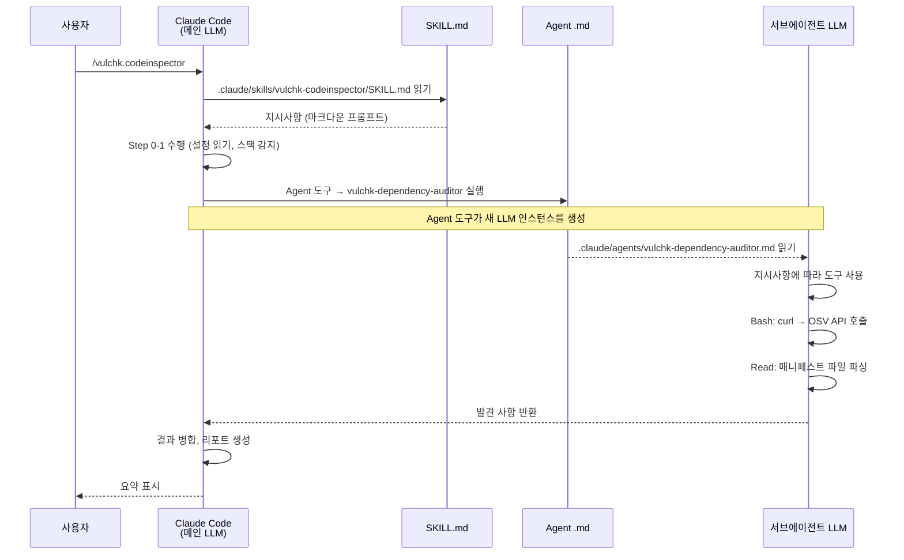
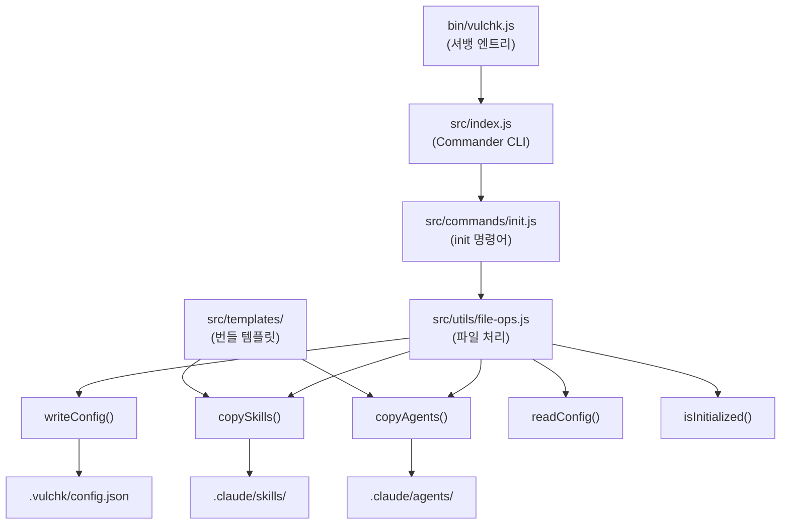
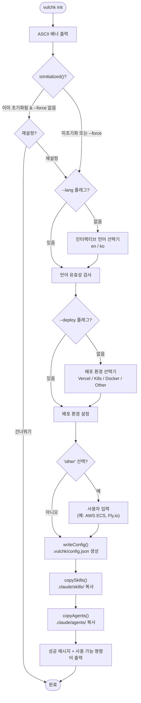
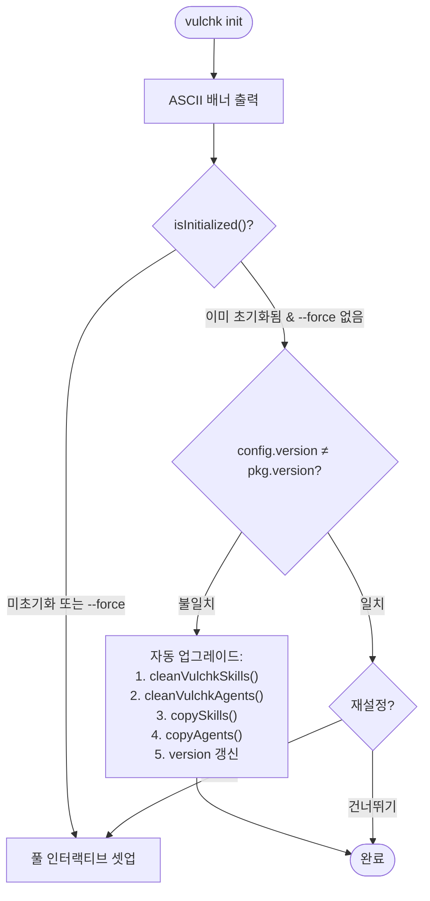

# VulChk 아키텍처

## 시스템 개요

VulChk는 **Claude Code 내부에서 실행**되는 보안 분석 툴킷이다.
자체 분석 엔진을 갖고 있지 않으며, 대신 사용자 프로젝트에 **스킬 파일**과
**에이전트 파일**을 설치하고, Claude Code의 LLM이 이 파일들을 프롬프트로
읽어서 분석을 수행하는 구조이다.

```
사용자
 │
 ▼
┌──────────────────────────────┐
│  vulchk CLI  (npm 패키지)     │   Node.js CLI 도구
│  vulchk init                 │   템플릿을 프로젝트에 복사
└──────────┬───────────────────┘
           │ 파일 생성:
           ▼
┌──────────────────────────────┐
│  대상 프로젝트                 │
│  ├── .vulchk/config.json     │   VulChk 설정
│  ├── .claude/skills/         │   스킬 파일 (오케스트레이터)
│  │   ├── vulchk-codeinspector/SKILL.md
│  │   └── vulchk-hacksimulator/SKILL.md
│  └── .claude/agents/         │   에이전트 파일 (서브에이전트)
│      ├── vulchk-dependency-auditor.md
│      ├── vulchk-code-pattern-scanner.md
│      ├── vulchk-secrets-scanner.md
│      ├── vulchk-git-history-auditor.md
│      ├── vulchk-container-security-analyzer.md
│      ├── vulchk-attack-planner.md
│      ├── vulchk-attack-executor-recon.md
│      ├── vulchk-attack-executor-injection.md
│      ├── vulchk-attack-executor-auth.md
│      ├── vulchk-attack-executor-business.md
│      ├── vulchk-attack-executor-baas.md
│      └── vulchk-attack-executor-exploit.md
└──────────────────────────────┘
```

## Claude Code 스킬/에이전트 실행 모델

### 핵심 개념

스킬과 에이전트는 **코드가 아니라 마크다운 파일**이다.
호출되면 Claude Code가 해당 마크다운 파일을 읽고, LLM이 그 안에 적힌
지시사항을 따라 사용 가능한 도구(Bash, Read, Grep 등)를 호출하면서 작업을 수행한다.



### 스킬 vs 에이전트

| 구분 | 파일 위치 | 역할 | LLM 인스턴스 |
|------|---------|------|-------------|
| **스킬** | `.claude/skills/{name}/SKILL.md` | 오케스트레이터 — 전체 흐름을 조율 | 메인 Claude Code LLM |
| **에이전트** | `.claude/agents/{name}.md` | 워커 — 특정 분석 작업 수행 | 새 서브에이전트 LLM (Agent 도구로 생성) |

### YAML 프론트매터

스킬과 에이전트 모두 YAML 프론트매터로 시작하며, Claude Code에 LLM 인스턴스 설정 방법을 알려준다.

**스킬 프론트매터:**
```yaml
---
name: vulchk-codeinspector
description: "Claude Code의 스킬 매칭을 위한 트리거 설명..."
allowed-tools: [Bash, Read, Grep, Glob, WebSearch, WebFetch, Agent]
---
```

**에이전트 프론트매터:**
```yaml
---
name: vulchk-dependency-auditor
description: "이 에이전트가 하는 일..."
model: sonnet              # 에이전트별 모델은 아래 표 참고
tools:
  - bash                   # 이 서브에이전트가 사용할 수 있는 도구
  - read
---
```

### 도구 접근 권한

LLM은 프론트매터에 나열된 도구만 사용할 수 있다. 주요 도구:

| 도구 | 설명 | 사용 주체 |
|------|------|---------|
| `Bash` | 셸 명령 실행 (curl, git, npm 등) | 스킬, 에이전트 |
| `Read` | 파일 내용 읽기 | 스킬, 에이전트 |
| `Grep` | 정규식으로 파일 내용 검색 | 스킬, 에이전트 |
| `Glob` | 패턴으로 파일 찾기 | 스킬, 에이전트 |
| `WebSearch` | 웹 검색 | 스킬 |
| `WebFetch` | URL 내용 가져오기 | 스킬 |
| `Agent` | 서브에이전트 실행 (새 LLM 인스턴스 생성) | 스킬만 |

## CLI 아키텍처



### `vulchk init` 실행 흐름



### 버전 동기화

`vulchk init`으로 설치된 스킬/에이전트 파일은 설치 당시 vulchk 버전 기준이다.
패키지 업데이트 후 `vulchk init`을 실행하면, config의 version과 패키지 version을
비교하여 **자동으로 템플릿을 갱신**한다.



**자동 업그레이드 동작:**
- 새 플래그/커맨드 없이 init 자체가 버전 불일치를 감지
- `vulchk-` 접두사 파일만 선별 삭제 후 새로 복사 (사용자 파일 보존)
- 기존 language/deployment 설정은 유지, version만 갱신
- 프롬프트 없이 자동 처리

**SKILL.md Step 0 자동 트리거:**
각 스킬의 Step 0에서 bash로 버전 비교 후, 불일치 시 `vulchk init`을 호출하여
스킬 실행 시점에도 자동으로 템플릿이 갱신된다:
```bash
CONFIG_VER=$(node -p "try{require('./.vulchk/config.json').version}catch{''}" 2>/dev/null)
PKG_VER=$(vulchk --version 2>/dev/null)
[ -n "$CONFIG_VER" ] && [ -n "$PKG_VER" ] && [ "$CONFIG_VER" != "$PKG_VER" ] && { vulchk init 2>/dev/null || true; }
```

### 파일 처리 함수 (`file-ops.js`)

| 함수 | 설명 |
|------|------|
| `getTemplatesDir()` | 번들된 `src/templates/` 경로 반환 |
| `writeConfig(root, config)` | `.vulchk/config.json` 생성 (`{language, deployment, version}`) |
| `readConfig(root)` | 설정 읽기, 없거나 손상된 경우 `null` 반환 |
| `isInitialized(root)` | `.vulchk/config.json` 존재 여부 확인 |
| `copySkills(root)` | `templates/skills/` → `.claude/skills/` 복사 |
| `copyAgents(root)` | `templates/agents/` → `.claude/agents/` 복사 |
| `cleanVulchkSkills(root)` | `.claude/skills/vulchk-*` 디렉토리 삭제 (사용자 파일 보존) |
| `cleanVulchkAgents(root)` | `.claude/agents/vulchk-*.md` 파일 삭제 (사용자 파일 보존) |

모든 파일 처리는 `fs-extra`를 ESM 디폴트 임포트 패턴으로 사용:
```js
import fse from 'fs-extra';
const { copySync, ensureDirSync, existsSync, readJsonSync, writeJsonSync } = fse;
```

## 컴포넌트 목록

### 스킬 (오케스트레이터)

| 스킬 | 슬래시 명령어 | 실행하는 서브에이전트 | 실행 전략 |
|------|-------------|-------------------|---------|
| `vulchk-codeinspector` | `/vulchk.codeinspector` | 5개 에이전트 | **병렬** — 5개 에이전트 동시 실행 |
| `vulchk-hacksimulator` | `/vulchk.hacksimulator [url]` | 7개 에이전트 (planner + 6 executor) | **순차** — planner → 승인 → 전문 executor (multi-pass) |

### 실행 전략 테이블

| 스킬 | 에이전트 | 모델 | 실행 순서 |
|------|---------|------|---------|
| codeinspector | dependency-auditor | sonnet | 병렬 |
| codeinspector | code-pattern-scanner | sonnet | 병렬 |
| codeinspector | secrets-scanner | sonnet | 병렬 |
| codeinspector | git-history-auditor | sonnet | 병렬 |
| codeinspector | container-security-analyzer | sonnet | 병렬 |
| hacksimulator | attack-planner | sonnet | 순차 1단계 |
| hacksimulator | (승인 게이트) | — | 순차 2단계 |
| hacksimulator | attack-executor-auth | sonnet | 순차 3단계 (Pass 0: pre-auth) |
| hacksimulator | attack-executor-recon | sonnet | 병렬 4단계 (Pass 1: passive) |
| hacksimulator | attack-executor-injection | sonnet | 병렬 4단계 (Pass 1: injection) |
| hacksimulator | attack-executor-auth | sonnet | 병렬 4단계 (Pass 1: app-logic) |
| hacksimulator | attack-executor-business | sonnet | 병렬 4단계 (Pass 1: business-logic, api) |
| hacksimulator | attack-executor-baas | sonnet | 조건부 4단계 (Pass 1: BaaS 감지 시) |
| hacksimulator | (phase별 에이전트) | sonnet | 순차 5단계 (Pass 2: 브라우저) |
| hacksimulator | attack-executor-exploit | sonnet | 순차 6단계 (Pass 3: aggressive만) |

### 리포트 정렬 규칙

발견 사항은 다음 기준으로 정렬된다. Finding #1이 항상 가장 위험한 항목이다.

1. **심각도 순** (1차 기준): Critical > High > Medium > Low > Informational
2. **카테고리 순** (2차 기준, 동일 심각도 내): CVE > OWASP > Secrets > Git > Container

### 에이전트 (워커)

| 에이전트 | 접두사 | 호출 주체 | 모델 | 주요 도구 | 핵심 기능 |
|---------|--------|---------|------|---------|----------|
| `vulchk-dependency-auditor` | DEP | codeinspector | sonnet | Bash (curl → OSV API) | Lock 파일 우선 읽기, 전이 의존성 포함 |
| `vulchk-code-pattern-scanner` | CODE | codeinspector | sonnet | Grep + Read | Evidence-Based Protocol (Step 0 파일 인벤토리), 4단계 CoT 추론 + Taint Analysis (Zod/Pydantic 인식), NoSQL·Prototype Pollution·Mass Assignment 탐지 |
| `vulchk-secrets-scanner` | SEC | codeinspector | sonnet | Grep + Glob | Glob/Grep 전용 파일 탐색, .gitignore 검증, 시크릿 탐지, DB URL 패턴 탐지, .temp/ 디렉토리 스캔 |
| `vulchk-git-history-auditor` | GIT | codeinspector | sonnet | Bash (git log -S) | 순차 명령 실행, 커밋 이력 시크릿 탐지 |
| `vulchk-container-security-analyzer` | CTR | codeinspector | sonnet | Read + Grep | 도구 사용 필수 프로토콜, 컨테이너 + CI/CD 파이프라인 보안, GH Actions SHA 핀 강화 탐지 |

### 안전 메커니즘 확장 (v2.5)

| 메커니즘 | 설명 |
|---------|------|
| **오케스트레이터 429 핸들링** | 스킬(오케스트레이터) 수준에서 sub-agent의 429 에러를 감지하고 전역적으로 cooldown(30s) 및 재시도 조율 |
| **현대적 Sanitizer 인식** | Zod, Pydantic 등 런타임 검증 라이브러리를 강력한 Sanitizer로 인식하여 오탐(False Positive) 제거 |
| **Aggressive 경고 강화** | 파괴적 테스트 가능성이 있는 Aggressive 모드에 대해 승인 게이트 시각적 경고 강화 |
| **Evidence-Based Analysis Protocol** | code-pattern-scanner에 Step 0 파일 인벤토리 구축, 증거 필수 규칙, 셀프체크 적용 — 53% 환각률 문제 해결 |
| **Tool-Based Analysis 강제** | container-security-analyzer에 Glob/Read 필수 사용 규칙 적용 — 도구 미사용 false positive 방지 |
| **CVE Feature Usage Validation** | DEP- High+ CVE에 대해 취약 기능의 실제 사용 여부를 검증하여 미사용 시 Low/Theoretical로 하향 |
| **DB/인프라 URL 탐지** | secrets-scanner에 PostgreSQL/MySQL/MongoDB/Redis/AMQP URL 패턴 및 .temp/ 디렉토리 스캔 추가 |
| **GH Actions SHA 핀 강화** | 버전 태그(@v4, @v4.1, @v4.1.1)도 unpinned로 탐지 — SHA-pinned만 허용 |
| **Deployment Skip Enforcement** | N/A(skip) 항목을 Low가 아닌 **강제 삭제** 처리, 최종 확인 스윕 수행 |
| **Finding Count Validation** | 리포트 생성 전 요약·Quick Fix·상세 발견 사항 합계 일치 필수 검증 |
| **Duplicate-Package Fix Prompt** | 동일 패키지 다중 CVE 시 각 발견 사항에 개별 Fix Prompt 필수 |
| `vulchk-attack-planner` | — | hacksimulator | sonnet | Bash (curl 정찰) | 비즈니스 로직 분석, 공격 시나리오 설계 |
| `vulchk-attack-executor-recon` | HSM | hacksimulator | sonnet | Bash (curl) | passive 정찰: 보안 헤더, CSP, 쿠키, CORS, TLS, 정보 노출 |
| `vulchk-attack-executor-injection` | HSM | hacksimulator | sonnet | Bash (curl) | 인젝션: XSS, SQLi (multi-DB baseline-delta), SSTI, 커맨드 인젝션, NoSQL |
| `vulchk-attack-executor-auth` | HSM | hacksimulator | sonnet | Bash (curl) | 인증: 4-Phase 세션 체이닝, JWT, IDOR, CSRF, SSRF, Rate Limiting |
| `vulchk-attack-executor-business` | HSM | hacksimulator | sonnet | Bash (curl) | 비즈니스 로직: 가격 변조, 매스 할당, 워크플로 우회, GraphQL, API |
| `vulchk-attack-executor-baas` | HSM | hacksimulator | sonnet | Bash (curl) | BaaS: Supabase RLS/service_role, Firebase 오픈 DB, Elasticsearch 노출 |
| `vulchk-attack-executor-exploit` | HSM | hacksimulator | sonnet | Bash (curl) | 익스플로잇: SQLi 추출, XSS PoC, SSRF 심층, JWT 위조, 레이스 컨디션 |

## 데이터 흐름

### 설정

```
.vulchk/config.json
├── language: "en" | "ko"                   → 리포트 언어
├── deployment: "vercel" | "k8s" | "docker" | "{custom}" → 배포 환경
└── version: "0.1.0"                        → 초기화 시점의 VulChk 버전
```

### 리포트 출력

```
./security-report/
├── codeinspector.md                      → 코드 점검 리포트 (단일 파일, 증분 업데이트)
└── hacksimulator-2025-01-15-150530.md    → 모의 침투 테스트 리포트 (실행별 새 파일)
```

**codeinspector**: 단일 파일로 관리되며, 실행할 때마다 덮어쓴다.
리포트 헤더에 기준 커밋 해시가 기록되어 있어, 다음 실행 시
두 커밋 간 diff 기반으로 증분 업데이트한다. 커밋되지 않은
변경사항이 있으면 실행을 거부한다.

**hacksimulator**: 실행할 때마다 타임스탬프가 붙은 새 파일이 생성된다.

리포트는 LLM이 생성하는 **마크다운 파일**이다. SKILL.md에서
`"Write the report in {language}"` 형식으로 언어를 지정하며, LLM이 해당 언어로
자연스럽게 리포트를 작성한다. 지원 언어는 en/ko 2개이다.
보안 용어(CVE, XSS, CSRF, OWASP, CWE)는 언어 설정과
무관하게 항상 영어로 유지된다.

### 민감값 처리

분석 중 발견된 모든 비밀값은 리포트에 기록하기 전에 **마스킹(redaction)**된다.
마스킹 규칙은 두 SKILL.md 파일에 정의되어 있다:

| 값 길이 | 마스킹 방식 |
|---------|-----------|
| >= 8자 | 앞 4자 + `****...****` + 뒤 4자 |
| < 8자 | 앞 2자 + `****` + 뒤 2자 |
| 개인키 | `[PRIVATE KEY REDACTED]` |
| 커넥션 스트링 | 비밀번호 부분만 마스킹 |

## 외부 의존성

### API

| API | 사용 주체 | 인증 필요 | 용도 |
|-----|---------|---------|------|
| [OSV.dev](https://osv.dev) | dependency-auditor | 불필요 | 패키지+버전 기반 CVE 조회 |

### 선택적 도구

| 도구 | 사용 주체 | 필수 여부 | 폴백 |
|------|---------|---------|------|
| [ratatosk-cli](https://github.com/letsur-dev/huginn) | hacksimulator | 선택 | HTTP 전용 테스트 |
| `npm audit` | dependency-auditor | 선택 | OSV API 실패 시 사용 |
| `pip-audit` | dependency-auditor | 선택 | OSV API 실패 시 사용 |
| `govulncheck` | dependency-auditor | 선택 | OSV API 실패 시 사용 |
