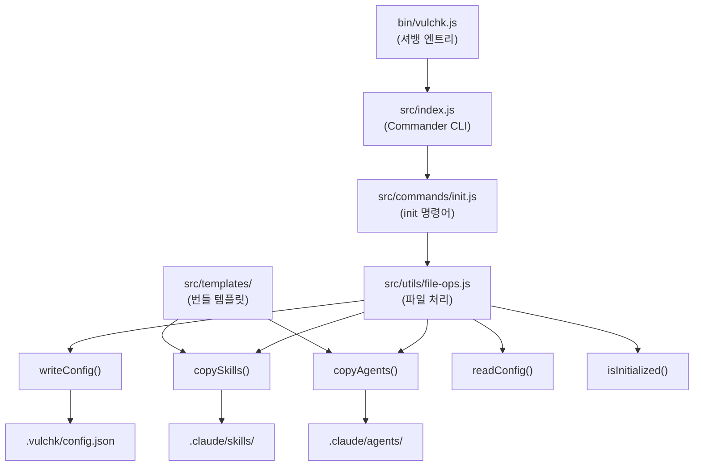
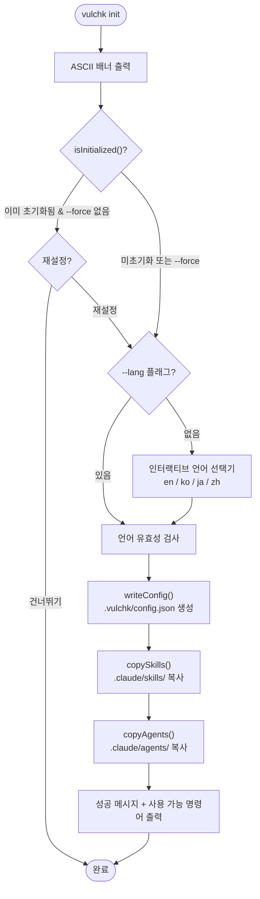

# VulChk 아키텍처

## 시스템 개요

VulChk는 **Claude Code 내부에서 실행**되는 보안 분석 툴킷이다.
자체 분석 엔진을 갖고 있지 않으며, 대신 사용자 프로젝트에 **스킬 파일**과
**에이전트 파일**을 설치하고, Claude Code의 LLM이 이 파일들을 프롬프트로
읽어서 분석을 수행하는 구조이다.

```
사용자
 │
 ▼
┌──────────────────────────────┐
│  vulchk CLI  (npm 패키지)     │   Node.js CLI 도구
│  vulchk init                 │   템플릿을 프로젝트에 복사
└──────────┬───────────────────┘
           │ 파일 생성:
           ▼
┌──────────────────────────────┐
│  대상 프로젝트                 │
│  ├── .vulchk/config.json     │   VulChk 설정
│  ├── .claude/skills/         │   스킬 파일 (오케스트레이터)
│  │   ├── vulchk-codeinspector/SKILL.md
│  │   └── vulchk-hacksimulator/SKILL.md
│  └── .claude/agents/         │   에이전트 파일 (서브에이전트)
│      ├── vulchk-dependency-auditor.md
│      ├── vulchk-code-pattern-scanner.md
│      ├── vulchk-secrets-scanner.md
│      ├── vulchk-git-history-auditor.md
│      ├── vulchk-container-security-analyzer.md
│      ├── vulchk-attack-planner.md
│      └── vulchk-attack-executor.md
└──────────────────────────────┘
```

## Claude Code 스킬/에이전트 실행 모델

### 핵심 개념

스킬과 에이전트는 **코드가 아니라 마크다운 파일**이다.
호출되면 Claude Code가 해당 마크다운 파일을 읽고, LLM이 그 안에 적힌
지시사항을 따라 사용 가능한 도구(Bash, Read, Grep 등)를 호출하면서 작업을 수행한다.


### 스킬 vs 에이전트

| 구분 | 파일 위치 | 역할 | LLM 인스턴스 |
|------|---------|------|-------------|
| **스킬** | `.claude/skills/{name}/SKILL.md` | 오케스트레이터 — 전체 흐름을 조율 | 메인 Claude Code LLM |
| **에이전트** | `.claude/agents/{name}.md` | 워커 — 특정 분석 작업 수행 | 새 서브에이전트 LLM (Task 도구로 생성) |

### YAML 프론트매터

스킬과 에이전트 모두 YAML 프론트매터로 시작하며, Claude Code에 LLM 인스턴스 설정 방법을 알려준다.

**스킬 프론트매터:**
```yaml
---
name: vulchk-codeinspector
description: "Claude Code의 스킬 매칭을 위한 트리거 설명..."
allowed-tools: [Bash, Read, Grep, Glob, WebSearch, WebFetch, Task]
---
```

**에이전트 프론트매터:**
```yaml
---
name: vulchk-dependency-auditor
description: "이 에이전트가 하는 일..."
model: sonnet              # 서브에이전트는 Sonnet 사용 (비용 효율)
tools:
  - bash                   # 이 서브에이전트가 사용할 수 있는 도구
  - read
---
```

### 도구 접근 권한

LLM은 프론트매터에 나열된 도구만 사용할 수 있다. 주요 도구:

| 도구 | 설명 | 사용 주체 |
|------|------|---------|
| `Bash` | 셸 명령 실행 (curl, git, npm 등) | 스킬, 에이전트 |
| `Read` | 파일 내용 읽기 | 스킬, 에이전트 |
| `Grep` | 정규식으로 파일 내용 검색 | 스킬, 에이전트 |
| `Glob` | 패턴으로 파일 찾기 | 스킬, 에이전트 |
| `WebSearch` | 웹 검색 | 스킬 |
| `WebFetch` | URL 내용 가져오기 | 스킬 |
| `Task` | 서브에이전트 실행 (새 LLM 인스턴스 생성) | 스킬만 |

## CLI 아키텍처



### `vulchk init` 실행 흐름



### 파일 처리 함수 (`file-ops.js`)

| 함수 | 설명 |
|------|------|
| `getTemplatesDir()` | 번들된 `src/templates/` 경로 반환 |
| `writeConfig(root, config)` | `.vulchk/config.json` 생성 (`{language, version}`) |
| `readConfig(root)` | 설정 읽기, 없거나 손상된 경우 `null` 반환 |
| `isInitialized(root)` | `.vulchk/config.json` 존재 여부 확인 |
| `copySkills(root)` | `templates/skills/` → `.claude/skills/` 복사 |
| `copyAgents(root)` | `templates/agents/` → `.claude/agents/` 복사 |

모든 파일 처리는 `fs-extra`를 ESM 디폴트 임포트 패턴으로 사용:
```js
import fse from 'fs-extra';
const { copySync, ensureDirSync, existsSync, readJsonSync, writeJsonSync } = fse;
```

## 컴포넌트 목록

### 스킬 (오케스트레이터)

| 스킬 | 슬래시 명령어 | 실행하는 서브에이전트 |
|------|-------------|-------------------|
| `vulchk-codeinspector` | `/vulchk.codeinspector` | 5개 에이전트 병렬 실행 |
| `vulchk-hacksimulator` | `/vulchk.hacksimulator [url]` | 2개 에이전트 순차 실행 |

### 에이전트 (워커)

| 에이전트 | 접두사 | 호출 주체 | 주요 도구 |
|---------|--------|---------|---------|
| `vulchk-dependency-auditor` | DEP | codeinspector | Bash (curl → OSV API) |
| `vulchk-code-pattern-scanner` | CODE | codeinspector | Grep (정규식 패턴 매칭) |
| `vulchk-secrets-scanner` | SEC | codeinspector | Grep + Glob |
| `vulchk-git-history-auditor` | GIT | codeinspector | Bash (git log -p -S) |
| `vulchk-container-security-analyzer` | CTR | codeinspector | Read + Grep |
| `vulchk-attack-planner` | — | hacksimulator | Bash (curl 정찰) |
| `vulchk-attack-executor` | HSM | hacksimulator | Bash (curl 공격) |

## 데이터 흐름

### 설정

```
.vulchk/config.json
├── language: "en" | "ko" | "ja" | "zh"   → 리포트 언어
└── version: "0.1.0"                        → 초기화 시점의 VulChk 버전
```

### 리포트 출력

```
./security-report/
├── codeinspector.md                      → 코드 점검 리포트 (단일 파일, 증분 업데이트)
└── hacksimulator-2025-01-15-150530.md    → 모의 침투 테스트 리포트 (실행별 새 파일)
```

**codeinspector**: 단일 파일로 관리되며, 실행할 때마다 덮어쓴다.
리포트 헤더에 기준 커밋 해시가 기록되어 있어, 다음 실행 시
두 커밋 간 diff 기반으로 증분 업데이트한다. 커밋되지 않은
변경사항이 있으면 실행을 거부한다.

**hacksimulator**: 실행할 때마다 타임스탬프가 붙은 새 파일이 생성된다.

리포트는 SKILL.md에 내장된 i18n 번역 테이블을 사용하여 LLM이 생성하는
**마크다운 파일**이다. 보안 용어(CVE, XSS, CSRF, OWASP, CWE)는 언어 설정과
무관하게 항상 영어로 유지된다.

### 민감값 처리

분석 중 발견된 모든 비밀값은 리포트에 기록하기 전에 **마스킹(redaction)**된다.
마스킹 규칙은 두 SKILL.md 파일에 정의되어 있다:

| 값 길이 | 마스킹 방식 |
|---------|-----------|
| >= 8자 | 앞 4자 + `****...****` + 뒤 4자 |
| < 8자 | 앞 2자 + `****` + 뒤 2자 |
| 개인키 | `[PRIVATE KEY REDACTED]` |
| 커넥션 스트링 | 비밀번호 부분만 마스킹 |

## 외부 의존성

### API

| API | 사용 주체 | 인증 필요 | 용도 |
|-----|---------|---------|------|
| [OSV.dev](https://osv.dev) | dependency-auditor | 불필요 | 패키지+버전 기반 CVE 조회 |

### 선택적 도구

| 도구 | 사용 주체 | 필수 여부 | 폴백 |
|------|---------|---------|------|
| [ratatosk-cli](https://github.com/letsur-dev/huginn) | hacksimulator | 선택 | HTTP 전용 테스트 |
| `npm audit` | dependency-auditor | 선택 | OSV API 실패 시 사용 |
| `pip-audit` | dependency-auditor | 선택 | OSV API 실패 시 사용 |
| `govulncheck` | dependency-auditor | 선택 | OSV API 실패 시 사용 |
