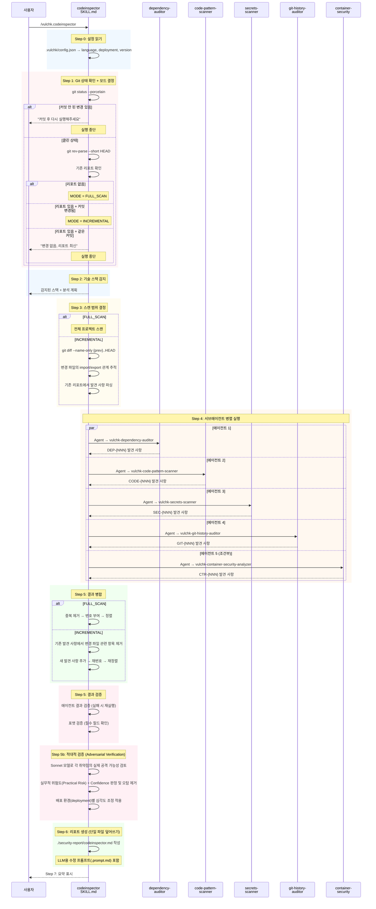
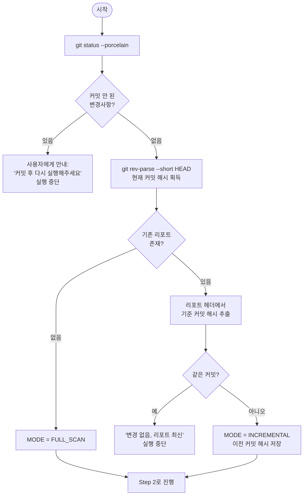
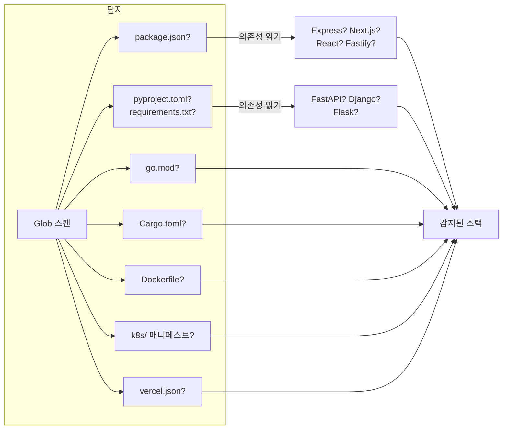
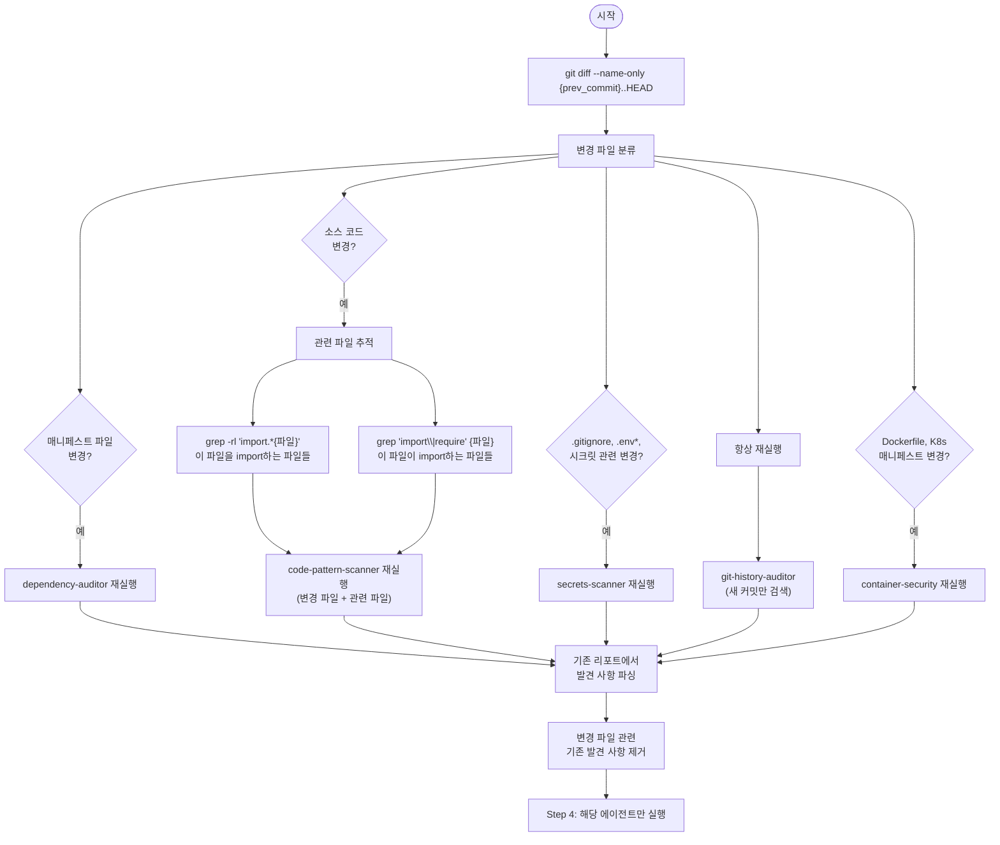
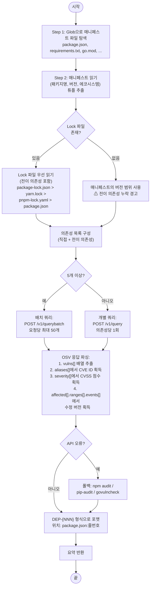
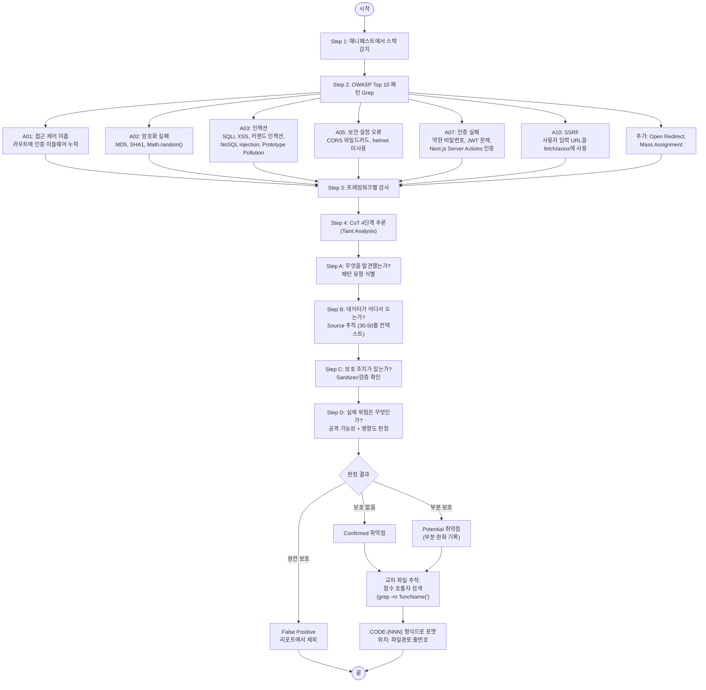
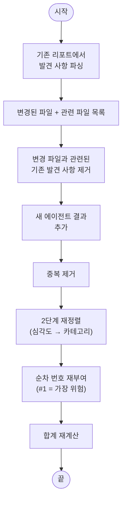
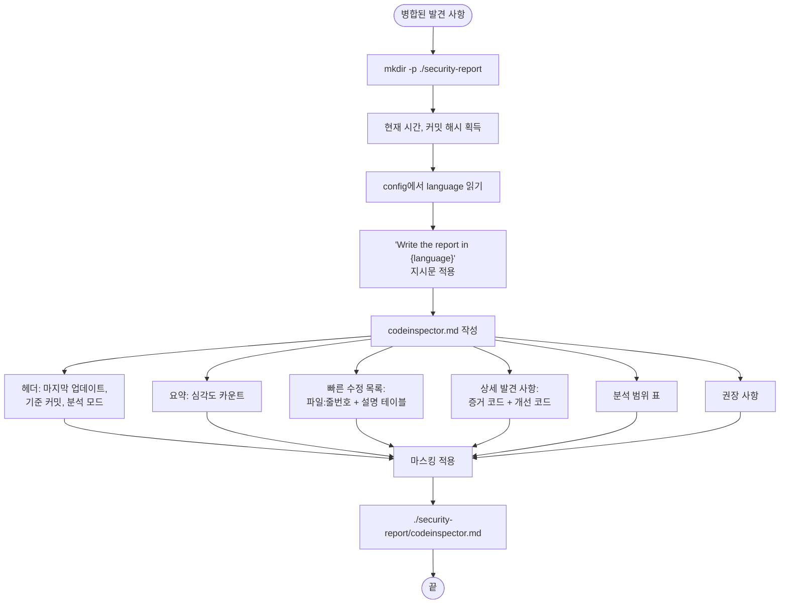

# Code Inspector — 상세 설계

## 개요

`/vulchk.codeinspector`는 현재 프로젝트의 정적 보안 분석을 수행한다.
`vulchk-codeinspector` SKILL.md가 오케스트레이터 역할을 하며, 최대 5개의
서브에이전트를 **병렬로** 실행한 후 결과를 하나의 리포트로 병합한다.

### 핵심 특징

- **단일 파일 리포트**: `./security-report/codeinspector.md` (타임스탬프 없음)
- **커밋 기반 추적**: 어떤 커밋 기준으로 분석했는지 리포트에 기록
- **증분 분석**: 두 번째 실행부터는 변경된 파일 + 관련 파일만 재분석
- **클린 커밋 필수**: 커밋되지 않은 변경사항이 있으면 실행 거부
- **정확한 위치**: 모든 발견 사항에 `파일:줄번호` 포함

### 실행 전략 테이블

5개 에이전트를 **모두 병렬**로 실행한다 (하나의 메시지에서 5개 Agent 도구 호출).

| 에이전트 | 모델 | 실행 방식 |
|---------|------|---------|
| dependency-auditor | sonnet | 병렬 |
| code-pattern-scanner | sonnet | 병렬 |
| secrets-scanner | sonnet | 병렬 |
| git-history-auditor | sonnet | 병렬 |
| container-security-analyzer | sonnet | 병렬 |

> v0.1.0 초기에는 secrets-scanner와 git-history-auditor에 haiku 모델을
> 사용했으나, 실전 테스트에서 도구 사용 실패(secrets-scanner) 및 비정상
> 종료(git-history-auditor)가 발생하여 **sonnet으로 격상**했다.

## 전체 실행 시퀀스



## 단계별 알고리즘

### Step 0: 설정 읽기

```
.vulchk/config.json 읽기
  → 추출: language (en|ko), deployment (vercel|k8s|docker|기타), version
  → 파일 없으면: language="en", deployment="other"로 기본 설정, `vulchk init` 실행 권고 경고
```

#### 배포 환경 (deployment) 활용

`vulchk init` 시 사용자가 선택한 배포 환경이 분석 전반에 영향을 미친다:

| 배포 환경 | 주요 조정 사항 |
|-----------|-------------|
| **vercel** | Dockerfile/K8s 관련 검사 스킵 (Vercel이 런타임 관리). vercel.json 보안 설정에 집중 |
| **k8s** | 전체 컨테이너 + K8s 분석. 리소스 제한은 pod spec 수준에서 중요 |
| **docker** | Dockerfile + docker-compose 전체 분석 |
| **기타** | 모든 검사를 기본 심각도로 적용 |

Step 5b(적대적 검증)에서 배포 환경별 심각도 조정 테이블을 적용한다:
- Docker 가변 태그 → 모든 환경에서 **Informational** (개발 운영 이슈)
- root 권한 실행 → Vercel에서 스킵, K8s/Docker에서 **High** (ownership 검증 포함)
- 리소스 제한 미설정 → Vercel에서 스킵, K8s에서 **Medium**
- 로깅 부족 → 모든 환경에서 **Informational**

### Step 1: Git 상태 확인 + 모드 결정

이 단계가 전체 실행 흐름의 핵심 분기점이다.



### Step 2: 기술 스택 감지

스킬이 Glob을 사용해 프로젝트 루트에서 다음 파일들을 확인한다:



### Step 3: 스캔 범위 결정

#### FULL_SCAN 모드

모든 서브에이전트가 프로젝트 전체를 스캔한다.

#### INCREMENTAL 모드



변경 파일 → 에이전트 매핑:

| 변경 파일 패턴 | 재실행할 에이전트 |
|--------------|----------------|
| `package.json`, `*lock*`, `requirements.txt`, `go.mod` 등 | dependency-auditor |
| `*.js`, `*.ts`, `*.py`, `*.go` 등 소스 코드 | code-pattern-scanner |
| `.gitignore`, `.env*`, `*.pem`, `*.key` 등 | secrets-scanner |
| (항상 — 새 커밋 대상) | git-history-auditor |
| `Dockerfile*`, `docker-compose*`, `k8s/**` 등 | container-security-analyzer |

**관련 파일 추적이 중요한 이유**: `utils/db.js`가 변경되었으면, 이를
import하는 `api/users.js`, `api/orders.js` 등도 재분석해야 한다.
변경된 유틸리티 함수가 새로운 취약점을 유발할 수 있기 때문이다.

### Step 4: 서브에이전트 병렬 실행

해당하는 모든 에이전트가 **하나의 메시지에서** (여러 Agent 도구 호출)
실행된다. 즉, 동시에 병렬로 실행된다.

INCREMENTAL 모드에서는 각 에이전트에 추가 컨텍스트를 전달한다:
- 변경된 파일 목록
- 관련 파일 목록
- "이 파일들만 스캔하라"는 지시

---

## 서브에이전트 1: Dependency Auditor

**파일**: `vulchk-dependency-auditor.md`
**발견 사항 접두사**: `DEP-{NNN}`
**모델**: sonnet
**주요 도구**: Bash (curl로 OSV API 호출)

### 알고리즘



### OSV API 요청/응답 예시

**요청** (단일):
```json
POST https://api.osv.dev/v1/query
{
  "package": { "name": "express", "ecosystem": "npm" },
  "version": "4.17.1"
}
```

**응답** (주요 필드):
```json
{
  "vulns": [
    {
      "id": "GHSA-xxxx-xxxx-xxxx",
      "aliases": ["CVE-2024-xxxxx"],
      "summary": "...",
      "severity": [{ "score": "CVSS:3.1/AV:N/AC:L/..." }],
      "affected": [{
        "ranges": [{
          "events": [
            { "introduced": "0" },
            { "fixed": "4.18.0" }
          ]
        }]
      }]
    }
  ]
}
```

### 에코시스템 매핑

| 매니페스트 파일 | OSV 에코시스템 |
|--------------|--------------|
| package.json / yarn.lock | `npm` |
| requirements.txt / Pipfile / pyproject.toml | `PyPI` |
| go.mod | `Go` |
| Cargo.toml | `crates.io` |
| pom.xml / build.gradle | `Maven` |
| Gemfile | `RubyGems` |
| composer.json | `Packagist` |

### CVSS → 심각도 매핑

| CVSS 점수 | 심각도 라벨 |
|----------|-----------|
| >= 9.0 | Critical |
| 7.0 - 8.9 | High |
| 4.0 - 6.9 | Medium |
| 0.1 - 3.9 | Low |

---

## 서브에이전트 2: Code Pattern Scanner

**파일**: `vulchk-code-pattern-scanner.md`
**발견 사항 접두사**: `CODE-{NNN}`
**모델**: sonnet
**주요 도구**: Grep (정규식 패턴 매칭) + Read (Taint Analysis)

### Chain of Thought (4단계 추론 체인)

code-pattern-scanner는 패턴 매칭 후 각 발견 사항에 대해 다음 4단계 추론을 명시적으로 수행한다:

| 단계 | 질문 | 설명 |
|------|------|------|
| **Step A** | 무엇을 발견했는가? | 정규식 매칭 결과와 패턴 유형 식별 |
| **Step B** | 데이터가 어디서 오는가? | Source 추적 — 사용자 입력, 외부 데이터, 설정값 등 |
| **Step C** | 보호 조치가 있는가? | Sanitizer/검증 로직 존재 여부 확인 |
| **Step D** | 실제 위험은 무엇인가? | A~C를 종합하여 실제 공격 가능성과 영향도 판정 |

이 4단계를 거쳐 False Positive를 줄이고, 각 발견 사항에 구체적인 근거를 제공한다.

### 알고리즘



제외 대상: `node_modules/`, `.git/`, `vendor/`, `__pycache__/`, `dist/`, `build/`, `*.min.js`

### Taint Analysis (오염 분석) 핵심

단순한 정규식 매칭을 넘어서, LLM의 문맥 이해 능력을 활용하여
**Source (사용자 입력)이 Sink (위험한 함수)에 검증 없이 도달하는지** 추적한다.
이 과정은 위 CoT의 Step B~D에 해당한다. (Memory Safety 검사는 v2.3에서 제거됨 — 바이브 코딩 사용자가 C/C++ 프로젝트를 개발할 가능성이 낮으므로 스코프에서 제외)

| 구분 | 예시 |
|------|------|
| **Source** (입력) | `req.body`, `req.params`, `searchParams`, `Body()`, `request.GET` |
| **Sink** (위험) | `db.query()`, `innerHTML`, `exec()`, `eval()`, `fetch(userUrl)`, `collection.find()`, `Object.assign()`, `Model.create(req.body)` |
| **Sanitizer** (검증) | **Zod (`.parse()`)**, **Pydantic Models**, 파라미터 바인딩, `DOMPurify.sanitize()`, 입력 검증, ORM 자동 파라미터화 |

정규식 매칭 → 30-50줄 컨텍스트 읽기 → Source 역추적 → Sanitizer 확인 → 판정

---

## 서브에이전트 3: Secrets Scanner

**파일**: `vulchk-secrets-scanner.md` | **접두사**: `SEC-{NNN}` | **모델**: sonnet | **도구**: Grep + Glob

.gitignore 검증 (**파일 존재 연계** — 해당 파일이 실제로 존재할 때만 보고) → 비밀 파일 존재 확인 → 소스 코드 시크릿 Grep → 프론트엔드 노출 검사.
테스트 파일의 발견 사항은 LOW로 하향 처리.

### 출력 포맷

각 발견 사항에 **Practical Risk** 및 **References** (CWE) 필드를 포함한다:

| 필드 | 설명 |
|------|------|
| Practical Risk | High / Medium / Low / Theoretical — 실 시크릿+미보호=High, 플레이스홀더=Theoretical |
| References | CWE-798 (하드코딩 자격증명), CWE-200 (민감 정보 노출) 등 |

### v2.1 BaaS / Cloud Platform Keys 패턴 추가

| 패턴 | 심각도 | 이유 |
|------|--------|------|
| `SUPABASE_SERVICE_ROLE_KEY` | **Critical** | RLS 전체 우회 가능 |
| `SUPABASE_JWT_SECRET` (quoted 또는 unquoted) | **Critical** | JWT 위조 가능 |
| Firebase Admin SDK `private_key` (RSA/EC/DSA/OPENSSH) | **Critical** | Firebase 서비스 전체 제어 |
| Firebase Admin SDK `client_email` | **Informational** | 단독 노출은 민감하지 않음; 같은 파일에 private_key가 있을 때만 Critical로 상향 |

.gitignore 검사 항목에 `*firebase-adminsdk*.json`, `supabase/.env` 추가.
파일 존재 검사 항목에 `*firebase-adminsdk*.json` 추가.

**패턴 상세 변경 이력 (v2.2)**:
- Firebase `private_key` 정규식: `(RSA )?` → `(RSA |EC |DSA |OPENSSH )?` — EC/DSA/OPENSSH 키 커버리지 추가
- `SUPABASE_JWT_SECRET` 정규식: 따옴표 필수 → 따옴표 선택적 (`["']?`) — `.env` 파일의 unquoted 값 탐지
- `client_email` 심각도: `High` → `Informational` — 단독으로는 민감하지 않음

## 서브에이전트 4: Git History Auditor

**파일**: `vulchk-git-history-auditor.md` | **접두사**: `GIT-{NNN}` | **모델**: sonnet | **도구**: Bash (git log -p -S)

커밋 diff에서 시크릿 패턴 검색 (15+ 패턴: AWS, GitHub PAT, OpenAI, Stripe, Slack, SendGrid, Supabase, DB 연결 문자열 등). INCREMENTAL 모드에서는 새 커밋만 대상.
HEAD에 여전히 존재하면 CRITICAL, 이력에만 남아있으면 HIGH.
**False positive 필터**: test/, fixtures/, .example 파일, placeholder 값(YOUR_KEY_HERE, changeme 등) 자동 제외.

### 출력 포맷

각 발견 사항에 **Practical Risk** 및 **References** (CWE) 필드를 포함한다:

| 필드 | 설명 |
|------|------|
| Practical Risk | High / Medium / Low — HEAD 존재 여부와 로테이션 상태 기반 판정 |
| References | CWE-798 (하드코딩 자격증명), CWE-540 (소스코드 내 민감 정보 포함) 등 |

## 서브에이전트 5: Container & CI/CD Security Analyzer

**파일**: `vulchk-container-security-analyzer.md` | **접두사**: `CTR-{NNN}` | **모델**: sonnet | **도구**: Read + Grep

Dockerfile/K8s 또는 CI/CD 파이프라인이 감지된 경우에만 실행.

### 검사 범위

| 카테고리 | 대상 파일 | 주요 검사 항목 |
|---------|----------|-------------|
| 컨테이너 | `Dockerfile*`, `docker-compose*` | 베이스 이미지, 권한, 빌드 시크릿, .dockerignore |
| Kubernetes | `k8s/**/*.yaml` | Pod 보안, 리소스 제한, 네트워크 정책, 시크릿 관리 |
| CI/CD | `.github/workflows/*`, `.gitlab-ci.yml` 등 | 시크릿 노출, 액션 핀, 권한, 인젝션 |
| 플랫폼 | `vercel.json`, `netlify.toml` | 보안 헤더, 리라이트 규칙 |

### CI/CD 보안 주요 검사 항목

| 검사 | 심각도 | 설명 |
|------|--------|------|
| 평문 시크릿 | Critical | 파이프라인 설정에 하드코딩된 비밀번호/API키 |
| 로그에 시크릿 출력 | High | `echo $SECRET`, `printenv` 등 |
| 미핀된 서드파티 액션 | Critical | `actions/checkout@main` → SHA 핀 필요 |
| 과도한 권한 | High | `permissions: write-all` → 최소 권한 원칙 |
| 사용자 입력 인젝션 | High | `${{ github.event.issue.title }}` 미검증 사용 |
| .dockerignore 미존재 | Medium | 민감 파일이 Docker 이미지에 포함될 수 있음 |

---

## Step 5: 결과 병합

### FULL_SCAN 모드

1. **중복 제거**: 같은 `file:line`을 참조하는 발견 사항 통합
2. **2단계 정렬**:
   - 1차: 심각도 순 — Critical > High > Medium > Low > Informational
   - 2차: 동일 심각도 내 카테고리 순 — CVE > OWASP > Secrets > Git > Container
3. **순차 번호 부여**: 1, 2, 3... (Finding #1이 항상 가장 위험한 항목)
4. **합계** 계산

### INCREMENTAL 모드



변경되지 않은 파일의 발견 사항은 그대로 유지된다.

## Step 6: 리포트 생성

**단일 파일**: `./security-report/codeinspector.md` (덮어쓰기)



### 리포트 헤더 예시

```markdown
# 코드 보안 점검 리포트

**마지막 업데이트**: 2026-03-01 23:15:00
**프로젝트**: my-project
**기술 스택**: Node.js 20, Next.js 14, PostgreSQL
**기준 커밋**: `a1b2c3d` — feat: add user API (2026-03-01)
**분석 모드**: 증분 검사 (이전: `d4e5f6g` → 현재: `a1b2c3d`)
**VulChk Version**: 0.1.0
```

### 빠른 수정 목록

리포트 상단에 위치하여 개발자가 바로 코드를 찾아갈 수 있도록 한다.
`#` 컬럼은 아래 상세 발견 사항의 해당 섹션으로 이동하는 **앵커 링크**를 포함한다.
각 상세 발견 사항 하단에는 `↑ 목차로 돌아가기` 링크가 포함되어 양방향 탐색을 지원한다.

```markdown
## 빠른 수정 목록

| # | 심각도 | 위치 | 설명 |
|---|--------|------|------|
| [1](#code-001-sql-injection) | Critical | `src/api/users.js:42` | SQL injection — 문자열 결합 |
| [2](#dep-001-express-4171--cve-2024-xxxxx) | Critical | `package.json:8` | express 4.17.1 — CVE-2024-xxxxx |
| [3](#sec-001-env-항목-누락) | High | `.gitignore` | .env 항목 누락 |
```

### 참조 하이퍼링크

모든 CVE, CWE, GHSA 참조에 외부 링크를 포함한다:

| 참조 유형 | URL 패턴 | 예시 |
|----------|---------|------|
| CVE | `https://nvd.nist.gov/vuln/detail/{ID}` | [CVE-2024-43796](https://nvd.nist.gov/vuln/detail/CVE-2024-43796) |
| CWE | `https://cwe.mitre.org/data/definitions/{NUM}.html` | [CWE-79](https://cwe.mitre.org/data/definitions/79.html) |
| GHSA | `https://github.com/advisories/{ID}` | [GHSA-qw6h-vgh9-j6wx](https://github.com/advisories/GHSA-qw6h-vgh9-j6wx) |
| OSV | `https://osv.dev/vulnerability/{ID}` | OSV 상세 페이지 |

dependency-auditor는 OSV API 응답의 `references` 배열에서 ADVISORY URL을 추출하여 포함한다.

### 위치 형식 규칙

모든 발견 사항에 정확한 위치를 포함하여 빠른 코드 탐색을 지원한다:

| 발견 사항 유형 | 위치 형식 | 예시 |
|---|---|---|
| 의존성 CVE | `매니페스트:줄번호` | `package.json:8` |
| OWASP 코드 패턴 | `소스파일:줄번호` | `src/api/users.js:42` |
| 소스 코드 시크릿 | `소스파일:줄번호` | `src/config.js:15` |
| .gitignore 누락 | `.gitignore` (줄번호 없음) | `.gitignore` |
| Git 이력 유출 | `커밋해시:파일경로` | `a1b2c3d:src/config.js` |
| 컨테이너 설정 | `설정파일:줄번호` | `Dockerfile:3` |

### i18n

SKILL.md에서 `"Write the report in {language}"` 형식으로 언어를 지정한다.
LLM이 해당 언어로 자연스럽게 리포트를 작성하며, 별도의 번역 테이블은 사용하지 않는다.
지원 언어: en, ko.
보안 용어 (CVE, XSS, CSRF, OWASP, CWE, SQLi, SSRF, IDOR)는
**절대 번역하지 않으며** 영어로 유지된다.

## Step 7: 사용자 요약

리포트 작성 후 터미널에 표시:
- 리포트 파일 경로
- 분석 모드 (전수/증분)
- 기준 커밋
- 심각도별 카운트
- 우선순위 상위 3개 항목 (`파일:줄번호` 포함)
- (증분 시) 새로 추가/해결된 발견 사항 수, 재분석 파일 수
- `/vulchk.hacksimulator`로 런타임 테스트 권고

## 에러 처리

- 서브에이전트가 실패하면 **분석 범위** 표에서 `SKIPPED`로 표기
- 취약점이 없어도 리포트 생성 (클린 결과 기록)
- 분석 계획은 사용자 승인 **불필요** (비파괴적)
