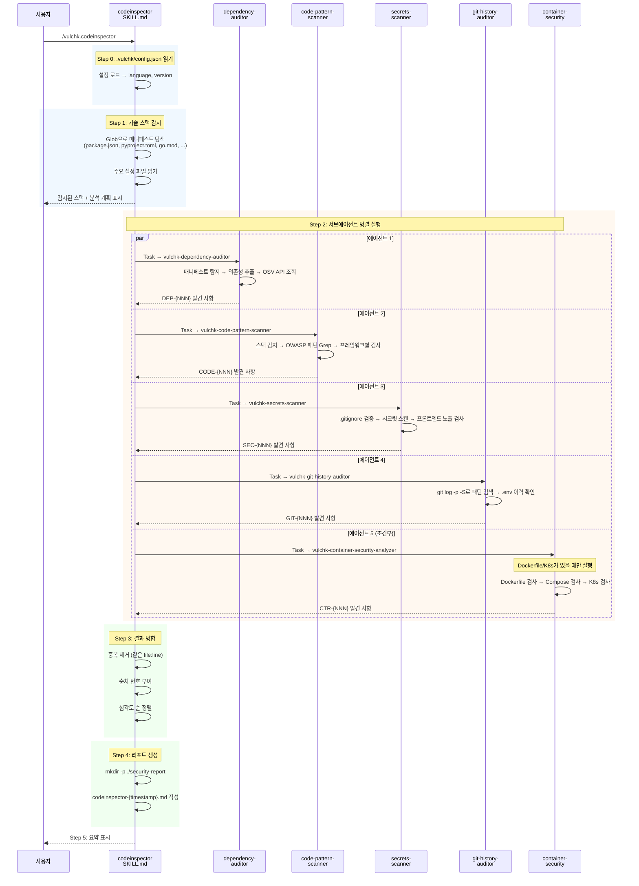
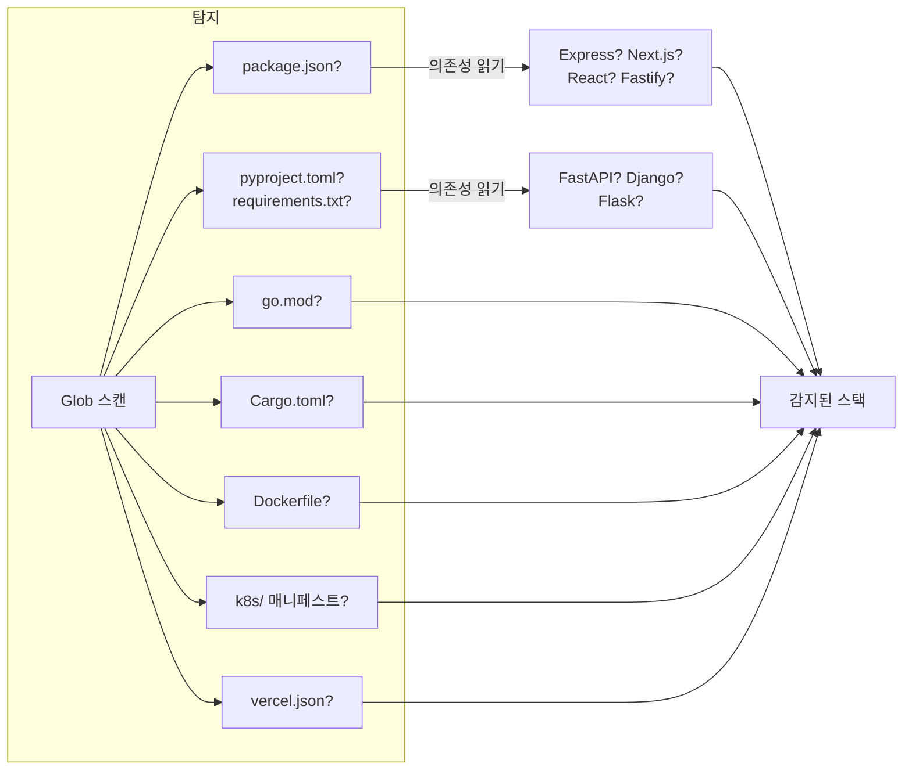
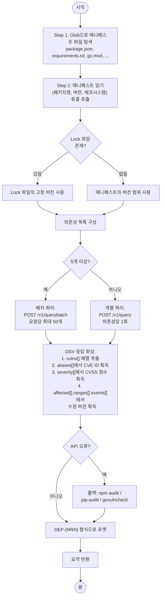
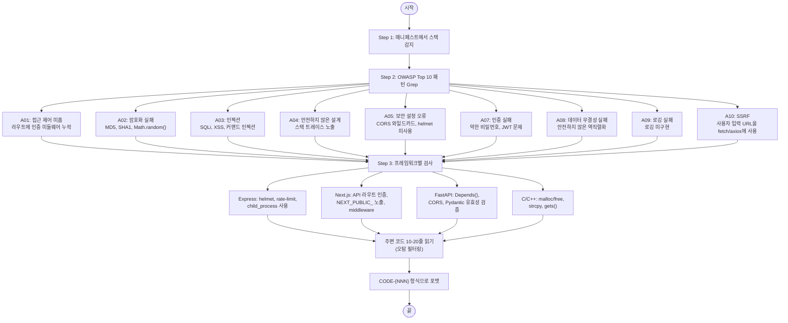
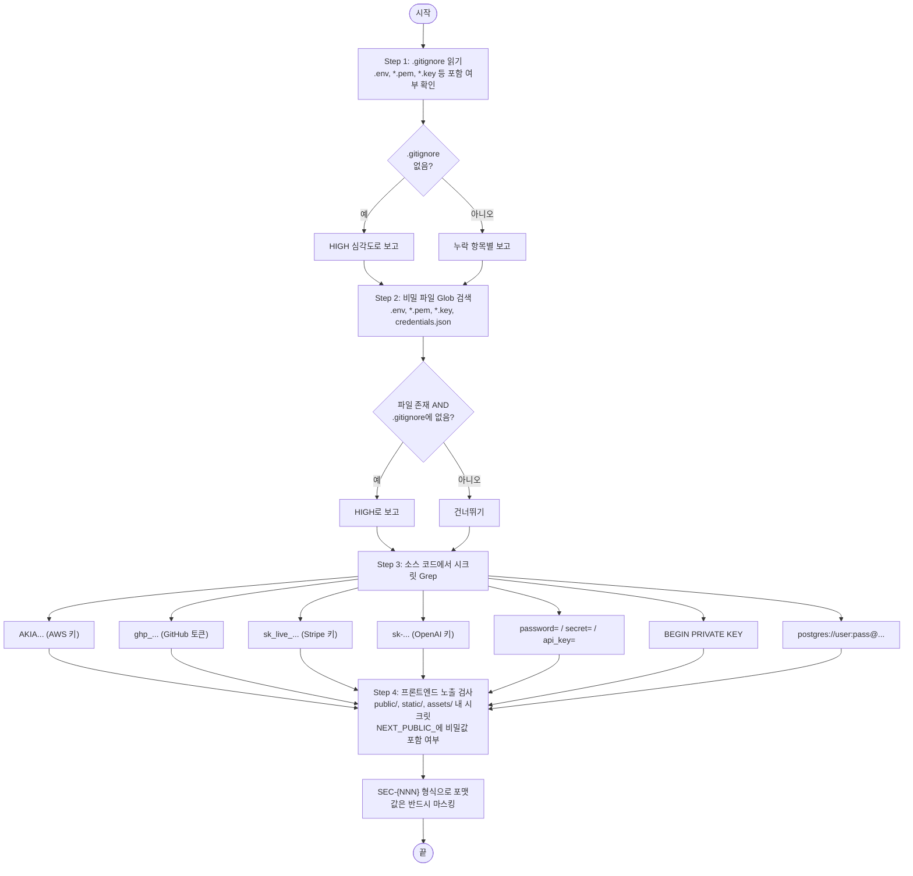
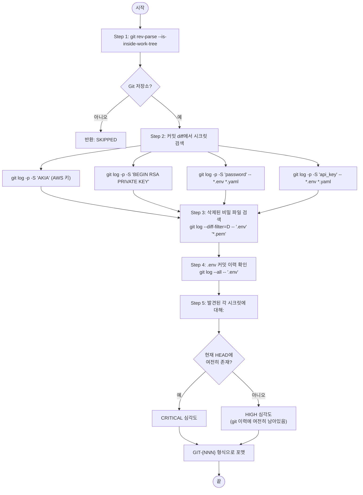
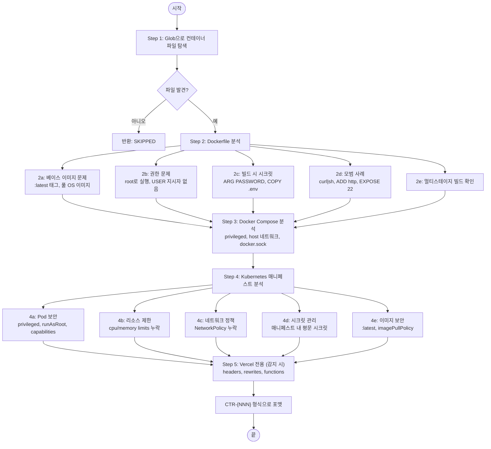
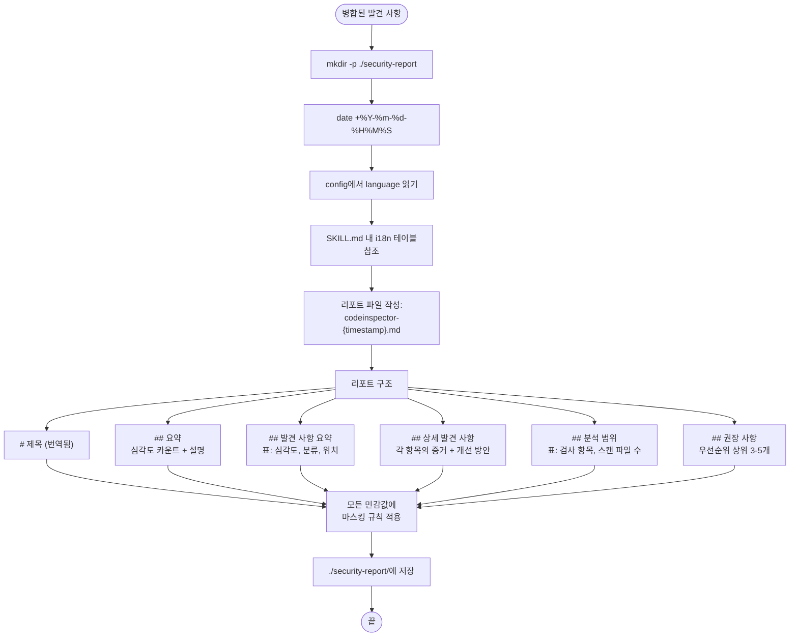

# Code Inspector — 상세 설계

## 개요

`/vulchk.codeinspector`는 현재 프로젝트의 정적 보안 분석을 수행한다.
`vulchk-codeinspector` SKILL.md가 오케스트레이터 역할을 하며, 최대 5개의
서브에이전트를 **병렬로** 실행한 후 결과를 하나의 리포트로 병합한다.

## 전체 실행 시퀀스



## 단계별 알고리즘

### Step 0: 설정 읽기

```
.vulchk/config.json 읽기
  → 추출: language (en|ko|ja|zh), version
  → 파일 없으면: "en"으로 기본 설정, `vulchk init` 실행 권고 경고
```

### Step 1: 기술 스택 감지

스킬이 Glob을 사용해 프로젝트 루트에서 다음 파일들을 확인한다:



감지된 스택에 따라 결정되는 것:
- 어떤 서브에이전트를 실행할지 (container-security는 조건부)
- 각 서브에이전트에 전달할 컨텍스트 (프레임워크별 검사 항목)

### Step 2: 서브에이전트 병렬 실행

해당하는 모든 에이전트가 **하나의 메시지에서** (여러 Task 도구 호출)
실행된다. 즉, 동시에 병렬로 실행된다.

---

## 서브에이전트 1: Dependency Auditor

**파일**: `vulchk-dependency-auditor.md`
**발견 사항 접두사**: `DEP-{NNN}`
**주요 도구**: Bash (curl로 OSV API 호출)

### 알고리즘



### OSV API 요청/응답 예시

**요청** (단일):
```json
POST https://api.osv.dev/v1/query
{
  "package": { "name": "express", "ecosystem": "npm" },
  "version": "4.17.1"
}
```

**응답** (주요 필드):
```json
{
  "vulns": [
    {
      "id": "GHSA-xxxx-xxxx-xxxx",
      "aliases": ["CVE-2024-xxxxx"],
      "summary": "...",
      "severity": [{ "score": "CVSS:3.1/AV:N/AC:L/..." }],
      "affected": [{
        "ranges": [{
          "events": [
            { "introduced": "0" },
            { "fixed": "4.18.0" }
          ]
        }]
      }]
    }
  ]
}
```

### 에코시스템 매핑

| 매니페스트 파일 | OSV 에코시스템 |
|--------------|--------------|
| package.json / yarn.lock | `npm` |
| requirements.txt / Pipfile / pyproject.toml | `PyPI` |
| go.mod | `Go` |
| Cargo.toml | `crates.io` |
| pom.xml / build.gradle | `Maven` |
| Gemfile | `RubyGems` |
| composer.json | `Packagist` |

### CVSS → 심각도 매핑

| CVSS 점수 | 심각도 라벨 |
|----------|-----------|
| >= 9.0 | Critical |
| 7.0 - 8.9 | High |
| 4.0 - 6.9 | Medium |
| 0.1 - 3.9 | Low |

---

## 서브에이전트 2: Code Pattern Scanner

**파일**: `vulchk-code-pattern-scanner.md`
**발견 사항 접두사**: `CODE-{NNN}`
**주요 도구**: Grep (정규식 패턴 매칭)

### 알고리즘



### 주요 패턴 카테고리

각 OWASP 카테고리에 특정 정규식 패턴이 있다. 스캐너는 모든 소스 파일에 대해
Grep을 실행하되, 다음은 **제외**한다:
`node_modules/`, `.git/`, `vendor/`, `__pycache__/`, `dist/`, `build/`, `*.min.js`

패턴이 매칭되면, 에이전트가 **주변 컨텍스트 (10-20줄)**을 읽어서
실제 취약점인지 판단한다. 예:
- `innerHTML =`이지만 입력이 sanitize된 경우 → 취약점 아님
- `helmet`을 import했지만 `app.use(helmet())`을 호출하지 않은 경우 → 취약점

---

## 서브에이전트 3: Secrets Scanner

**파일**: `vulchk-secrets-scanner.md`
**발견 사항 접두사**: `SEC-{NNN}`
**주요 도구**: Grep + Glob

### 알고리즘



### 테스트 파일 처리

`*test*`, `*spec*`, `*mock*`, `*fixture*` 패턴에 매칭되는 파일의 발견 사항은
HIGH 대신 LOW 심각도로 하향 처리된다 (예: 테스트 파일의 `password = "test123"`).

---

## 서브에이전트 4: Git History Auditor

**파일**: `vulchk-git-history-auditor.md`
**발견 사항 접두사**: `GIT-{NNN}`
**주요 도구**: Bash (git log -p -S)

### 알고리즘



### 제한 사항

- 최대 500개 최근 커밋만 검색
- git 검색 출력은 `head -200`으로 제한 (타임아웃 방지)
- 커밋 5000개 초과 시 전용 도구(trufflehog, gitleaks) 사용 권장

---

## 서브에이전트 5: Container Security Analyzer

**파일**: `vulchk-container-security-analyzer.md`
**발견 사항 접두사**: `CTR-{NNN}`
**주요 도구**: Read + Grep
**실행 조건**: Dockerfile, docker-compose, 또는 K8s 매니페스트가 감지된 경우에만

### 알고리즘



---

## Step 3: 결과 병합

모든 서브에이전트가 반환된 후, 오케스트레이터 스킬이:

1. **중복 제거**: 같은 `file:line`을 참조하는 발견 사항 통합
   (예: secrets-scanner와 code-pattern-scanner가 같은 하드코딩 키를 발견한 경우)
2. **순차 번호 부여**: 에이전트별 접두사를 1, 2, 3...으로 대체
3. **심각도 순 정렬**: Critical > High > Medium > Low > Informational
4. **심각도별 합계** 계산

## Step 4: 리포트 생성



### i18n 번역

SKILL.md 파일에 `en`, `ko`, `ja` 컬럼이 있는 번역 테이블이 포함되어 있다.
모든 섹션 헤더와 라벨이 이 테이블에서 조회된다. 예시:

| en | ko | ja |
|---|---|---|
| Executive Summary | 요약 | エグゼクティブサマリー |
| Findings Summary | 발견 사항 요약 | 検出事項サマリー |
| Severity | 심각도 | 深刻度 |

보안 용어 (CVE, XSS, CSRF, OWASP, CWE, SQLi, SSRF, IDOR)는 **절대 번역하지
않으며** 모든 언어에서 영어로 유지된다.

### 심각도 라벨

| en | ko | ja |
|---|---|---|
| Critical | Critical (치명적) | Critical (致命的) |
| High | High (높음) | High (高) |
| Medium | Medium (중간) | Medium (中) |
| Low | Low (낮음) | Low (低) |
| Informational | Informational (정보) | Informational (情報) |

## Step 5: 사용자 요약

리포트 작성 후 터미널에 간략 요약을 표시:
- 리포트 파일 경로
- 심각도별 카운트
- 우선순위 상위 3개 항목
- `/vulchk.hacksimulator`로 런타임 테스트 권고

## 에러 처리

- 서브에이전트가 실패하거나 타임아웃되면, **분석 범위** 표에서
  `SKIPPED`로 표기하고 다른 에이전트의 결과로 리포트를 계속 생성한다
- 분석 계획은 표시되지만 사용자 승인이 **필요 없다**
  (코드 점검은 비파괴적)
- 취약점이 발견되지 않더라도 어떤 검사를 수행했고 결과가
  깨끗했다는 내용의 리포트를 생성한다
