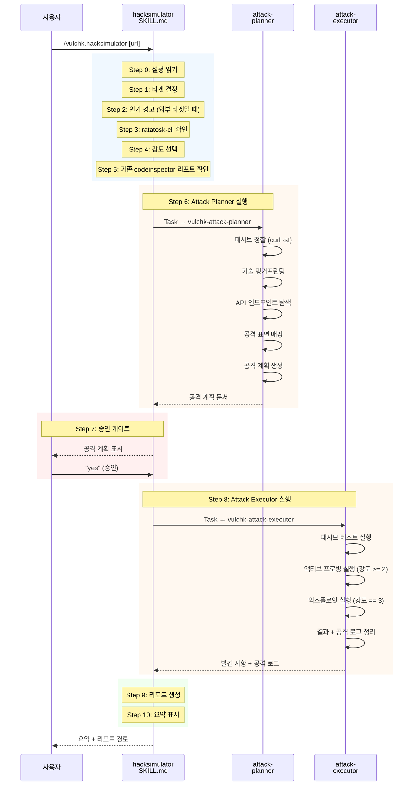
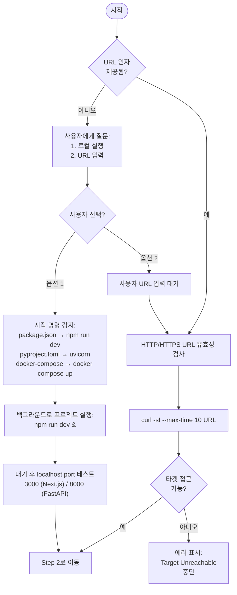
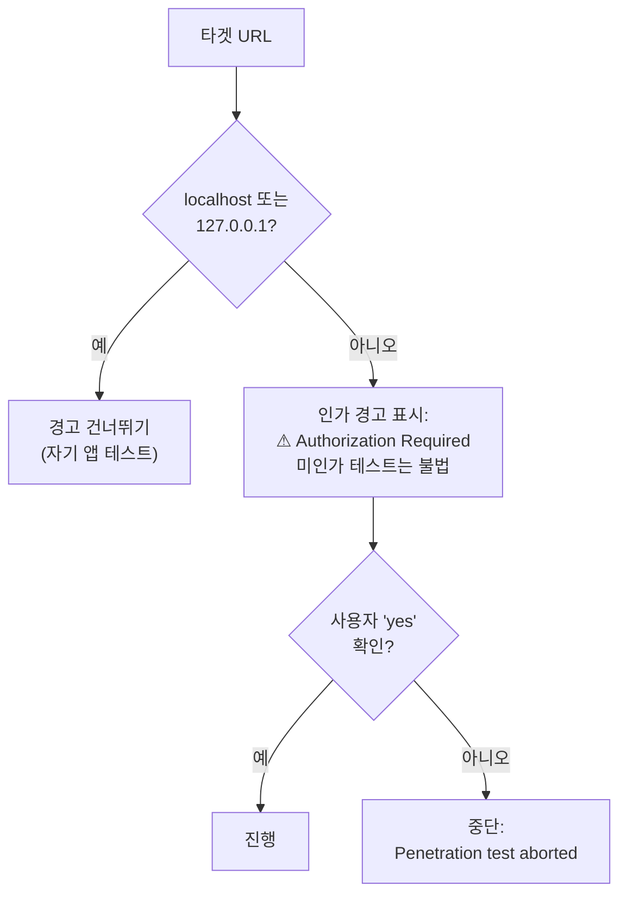
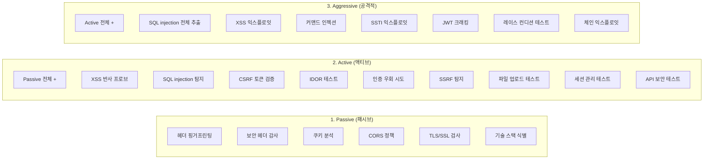
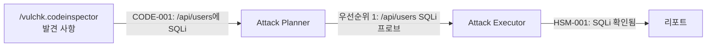
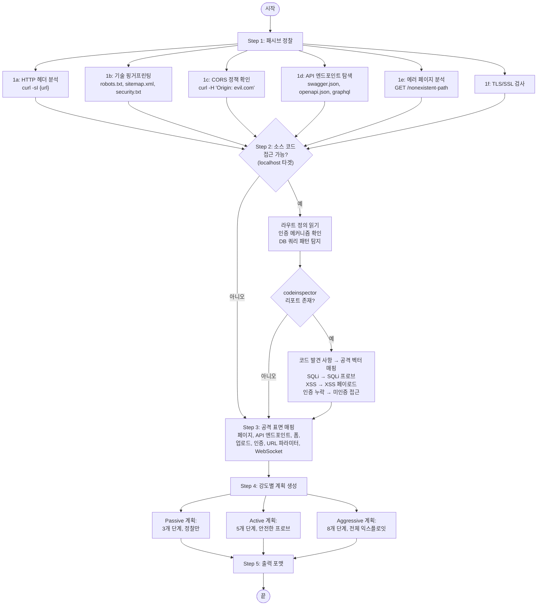
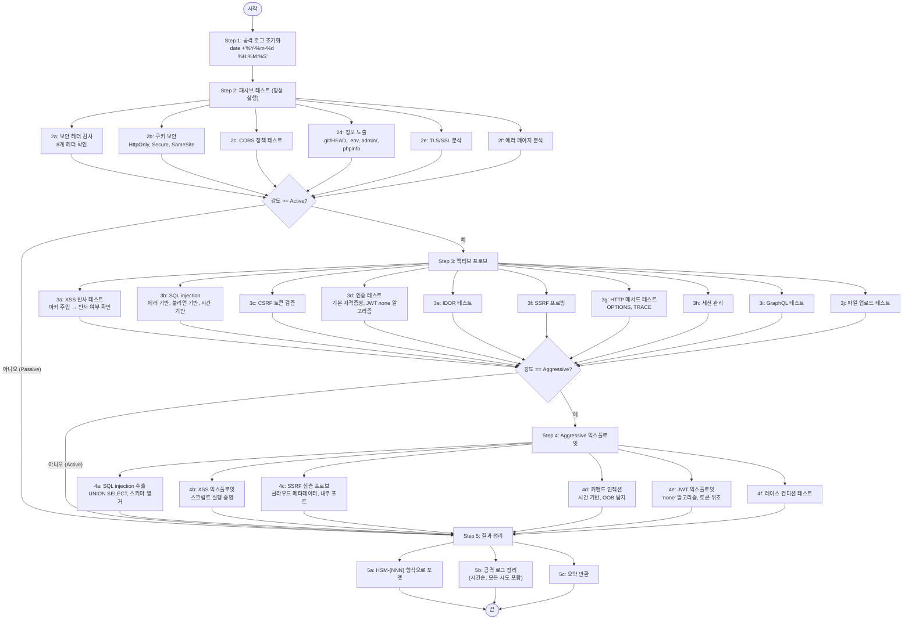
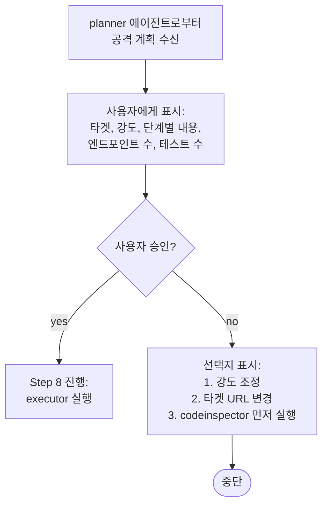

# Hack Simulator — 상세 설계

## 개요

`/vulchk.hacksimulator`는 실행 중인 웹 애플리케이션에 대해 모의 침투 테스트를
수행한다. 정적 코드를 분석하는 codeinspector와 달리, 이 스킬은 실제 HTTP 요청을
타겟에 전송하고 런타임 취약점을 보고한다.

**핵심 안전장치:**
- localhost가 아닌 외부 타겟에 대해 인가(authorization) 경고
- 테스트 시작 전 공격 계획 승인 필수
- 모든 요청을 타임스탬프와 함께 로깅

## 전체 실행 시퀀스



## 단계별 알고리즘

### Step 0: 설정 읽기

```
.vulchk/config.json 읽기 → language, version
파일 없으면 → "en"으로 기본 설정, 경고 표시
```

### Step 1: 타겟 결정



### Step 2: 인가 확인



### Step 3: ratatosk-cli 감지

```bash
which ratatosk 2>/dev/null && echo "FOUND" || echo "NOT_FOUND"
```

발견되면 추가 확인:
```bash
ls .claude/skills/ratatosk/ 2>/dev/null && echo "SKILLS_OK" || echo "NO_SKILLS"
```

`RATATOSK_AVAILABLE` 플래그를 설정한다. 미설치 시 HTTP 전용 테스트로
진행하며, 사용자에게 안내 메시지를 표시한다.

### Step 4: 강도 선택

사용자가 3단계 중 하나를 선택한다:



### Step 5: 기존 Code Inspector 리포트 확인

```bash
ls -t ./security-report/codeinspector-*.md 2>/dev/null | head -1
```

codeinspector 리포트가 존재하면, 발견 사항을 읽어서 attack planner에게
전달하여 공격 벡터의 우선순위를 결정한다. 이것이 **피드백 루프**를 형성한다:



---

## 서브에이전트: Attack Planner

**파일**: `vulchk-attack-planner.md`
**호출 시점**: hacksimulator SKILL.md Step 6
**주요 도구**: Bash (curl로 정찰)
**출력**: 구조화된 공격 계획 문서

### 알고리즘



### codeinspector 발견 사항 → 공격 벡터 매핑

| 코드 발견 사항 | 공격 벡터 |
|---|---|
| SQL injection 패턴 (CODE-*) | 해당 엔드포인트에 SQLi 프로브 |
| XSS 취약점 (CODE-*) | 해당 입력에 XSS 페이로드 테스트 |
| 인증 미들웨어 누락 (CODE-*) | 미인증 접근 시도 |
| CORS 설정 오류 (CODE-*) | 자격 증명 포함 크로스 오리진 요청 |
| SSRF 패턴 (CODE-*) | 콜백 URL로 SSRF 프로브 |
| 하드코딩된 시크릿 (SEC-*) | 발견된 자격 증명으로 접근 |
| CSRF 토큰 누락 (CODE-*) | CSRF 위조 시도 |

---

## 서브에이전트: Attack Executor

**파일**: `vulchk-attack-executor.md`
**발견 사항 접두사**: `HSM-{NNN}`
**호출 시점**: hacksimulator SKILL.md Step 8 (계획 승인 후)
**주요 도구**: Bash (curl로 공격 수행)

### 알고리즘



### 공격 로그 형식

타겟에 보낸 **모든 요청**이 기록된다:

```
| # | 타임스탬프 | 벡터 | 엔드포인트 | 페이로드 | 상태 | 결과 |
|---|-----------|------|----------|---------|------|------|
| 1 | 2025-01-01 10:00:01 | http-fetch | GET / | (없음) | 200 | 헤더 수집됨 |
| 2 | 2025-01-01 10:00:02 | http-fetch | GET /robots.txt | (없음) | 200 | 경로 발견됨 |
```

벡터 종류:
- `http-fetch` — curl/fetch HTTP 요청
- `browser` — ratatosk-cli 브라우저 자동화
- `api-probe` — API 전용 테스트 (GraphQL, REST)

### 테스트 페이로드 규칙

모든 테스트 페이로드는 `vulchk-` 접두사를 사용하여 식별:
- XSS: `vulchk-xss-probe-12345`
- 파일 업로드: `/tmp/vulchk-test.txt`
- 에러 페이지: `/vulchk-nonexistent-test-path`

### 안전 메커니즘

| 메커니즘 | 설명 |
|---------|------|
| Rate limiting 감지 | 429 응답 시 일시 중지, 로그에 기록 |
| WAF 감지 | 프로브에 403 응답 시 WAF 제품 식별 |
| 비파괴적 페이로드 | 접근 가능성만 증명, 실제 사용자 데이터 추출 안 함 |
| 마스킹 | 발견된 모든 자격 증명은 마스킹 처리 |
| DoS 금지 | 스레드 고갈이나 리소스 플러딩 금지 |
| 정리 | 테스트 후 임시 파일 삭제 |

---

## Step 7: 승인 게이트

핵심 안전장치이다. 어떤 테스트가 수행될지에 대한 전체 세부사항을
포함한 공격 계획이 사용자에게 표시된다.
사용자가 명시적으로 승인할 때까지 **타겟에 어떠한 요청도 전송되지 않는다**.



## Step 9: 리포트 생성

codeinspector와 동일한 메커니즘 — SKILL.md의 i18n 번역 테이블 사용.
hacksimulator 전용 추가 섹션:

| 섹션 | 설명 |
|------|------|
| 공격 계획 요약 | 강도, codeinspector 기반 / 런타임 정찰 기반 여부 |
| 공격 로그 | 모든 테스트 시도의 시간순 전체 로그 |
| 테스트 범위 | 수행된 테스트, 건너뛴 테스트, 제약 사항 |
| 강도 라벨 | 언어별 번역 (Passive/Active/Aggressive) |

### 강도 라벨 (언어별)

| en | ko | ja |
|---|---|---|
| Passive | Passive (패시브) | Passive (パッシブ) |
| Active | Active (액티브) | Active (アクティブ) |
| Aggressive | Aggressive (공격적) | Aggressive (アグレッシブ) |

## Step 10: 정리

요약 표시 후:

1. 로컬 실행을 사용한 경우 (Step 1, 옵션 1), 백그라운드 서버 종료:
   ```bash
   kill %1 2>/dev/null
   ```

2. 테스트 중 생성된 임시 파일 정리:
   ```bash
   rm -f /tmp/vulchk-test.txt
   ```

## Codeinspector vs Hacksimulator 비교

| 항목 | Codeinspector | Hacksimulator |
|------|-------------|--------------|
| 분석 유형 | 정적 (코드) | 동적 (런타임) |
| 대상 | 프로젝트 소스 파일 | 실행 중인 웹 애플리케이션 |
| 승인 필요 | 아니오 (비파괴적) | 예 (요청 전송) |
| 서브에이전트 | 5개 병렬 | 2개 순차 |
| 외부 네트워크 | OSV API만 | 타겟 URL + 정찰 |
| 출력 접두사 | DEP/CODE/SEC/GIT/CTR | HSM |
| 사전 데이터 | 없음 | codeinspector 리포트 활용 가능 |
| 벡터 | Grep, Read, Bash | curl, ratatosk (브라우저) |
