# Hack Simulator — 상세 설계

## 개요

`/vulchk.hacksimulator`는 실행 중인 웹 애플리케이션에 대해 모의 침투 테스트를
수행한다. 정적 코드를 분석하는 codeinspector와 달리, 이 스킬은 실제 HTTP 요청을
타겟에 전송하고 런타임 취약점을 보고한다.

**핵심 안전장치:**
- localhost가 아닌 외부 타겟에 대해 인가(authorization) 경고
- 테스트 시작 전 공격 계획 승인 필수
- 모든 요청을 타임스탬프와 함께 로깅

**v2 주요 변경점:**
- `.vulchk/hacksim/` 워크스페이스로 영속적 중간 파일 관리
- Multi-Pass 실행 모델 (auth pre-pass → HTTP 병렬 → 브라우저 순차 → 익스플로잇 순차)
- 증분 모드 (git diff 기반, 변경된 파일만 재테스트)
- Methodology 섹션 (단계별 실행 시간, 테스트 수, 시나리오 커버리지)
- 단계별(phase) 실행으로 컨텍스트 분산

**v2.5 주요 변경점:**
- **Practical Risk + Intended Access Model**: 심각도 오분류 방지를 위해 실제 악용 가능성과 의도된 접근 모델을 발견사항에 추가
- **Severity Adjustment Rules**: 공개 API, 비활성 기능, 영향 없는 수용 등에 대한 자동 심각도 보정 규칙
- **Test Result Summary**: 취약(조치 필요) / 안전(이상 없음) / 미테스트(건너뜀) 3분류 보고서 섹션
- **Base Commit 추적**: 리포트 헤더에 git commit 해시 및 메시지 포함
- **DB 쓰기 승인 플로우**: 공격 계획 승인 후 DB 변경 시나리오에 대한 별도 사전 승인 (Step 7b)
- **DB 롤백 사이클**: DB 쓰기 테스트 후 자동 원복 시도 (Step 8b)
- **Cross-Agent 불일치 탐지**: 서로 다른 에이전트의 동일 엔드포인트 상충 결과 감지
- **Rate Limiting 탐지**: RECON phase에서 429 응답 부재 시 Rate Limiting 미구현 보고

### 실행 전략 테이블

planner 결과를 사용자가 승인한 후에만 executor가 실행된다.
executor는 **단계별로 분리**되어 HTTP 단계는 병렬, 브라우저/익스플로잇 단계는 순차 실행한다.

| 순서 | 단계 | 에이전트 | 모델 | 실행 방식 |
|------|------|---------|------|----------|
| 1 | 정찰 + 계획 수립 | attack-planner | sonnet | 단일 |
| 2 | 승인 게이트 | (SKILL.md 직접 처리) | — | — |
| 2b | **DB 쓰기 영향 평가** | (SKILL.md 직접 처리) | — | — |
| 3a | Pass 0: 인증 (pre-auth) | attack-executor × 1 | sonnet | **순차** (세션 획득) |
| 3b | Pass 1: HTTP 테스트 | attack-executor × 5 | sonnet | **병렬** (세션 재사용) |
| 3c | Pass 2: 브라우저 테스트 | attack-executor × M | sonnet | 순차 |
| 3d | Pass 3: 익스플로잇 | attack-executor × K | sonnet | 순차 |
| 4 | **DB 롤백** | (SKILL.md 직접 처리) | — | — |

## 워크스페이스 구조

`.vulchk/hacksim/` 디렉토리에 영속적 중간 파일을 저장한다:

```
.vulchk/hacksim/
├── session.json              # 세션 메타데이터 (타겟, 커밋, 타임스탬프, 강도)
├── site-analysis.md          # Planner 출력: CSS 셀렉터, API 엔드포인트, DB 패턴, 인증 메커니즘
├── attack-scenarios.md       # Planner 출력: 구조화된 공격 시나리오 정의 (AS-{NNN})
├── attack-plan.md            # Planner 출력: 승인된 공격 계획
├── methodology.json          # 단계별 타임스탬프, 소요 시간, 테스트 수
├── cookies.txt               # 쿠키 저장소
├── tokens.json               # JWT/인증 토큰
├── db-writes.json            # DB 쓰기 로그 (롤백용, Step 4b에서 초기화)
├── db-rollback.json          # DB 롤백 결과
└── phases/                   # 단계별 executor 결과
    ├── phase-1-passive.md
    ├── phase-2-injection.md
    ├── phase-3-auth.md
    ├── phase-4-app-logic.md
    ├── phase-5-business-logic.md
    ├── phase-6-api.md
    ├── phase-7-exploitation.md
    ├── phase-8-advanced.md
    └── phase-9-post-exploit.md
```

### 파일 영속성 규칙

| 파일 | 생성 시점 | 삭제 시점 | 용도 |
|------|---------|---------|------|
| `session.json` | 리포트 생성 후 | 사용자 수동 삭제 | 증분 모드 감지 |
| `site-analysis.md` | Planner 실행 시 | 사용자 수동 삭제 | 정찰 데이터 재사용 |
| `attack-scenarios.md` | Planner 실행 시 | 사용자 수동 삭제 | 시나리오 필터링 |
| `phases/*.md` | Executor 단계별 완료 시 | 다음 실행 시 덮어쓰기 | 결과 수집 |
| `methodology.json` | 각 단계 완료 시 업데이트 | 다음 실행 시 초기화 | 리포트 Methodology 섹션 |
| `cookies-*.txt` | 병렬 단계 시작 시 복사 | 단계 완료 후 삭제 | 병렬 격리 |
| `db-writes.json` | Executor DB 쓰기 시 | Step 4b에서 초기화 | 롤백 대상 기록 |
| `db-rollback.json` | Step 8b 롤백 완료 시 | 다음 실행 시 덮어쓰기 | 롤백 결과 기록 |

## 전체 실행 시퀀스

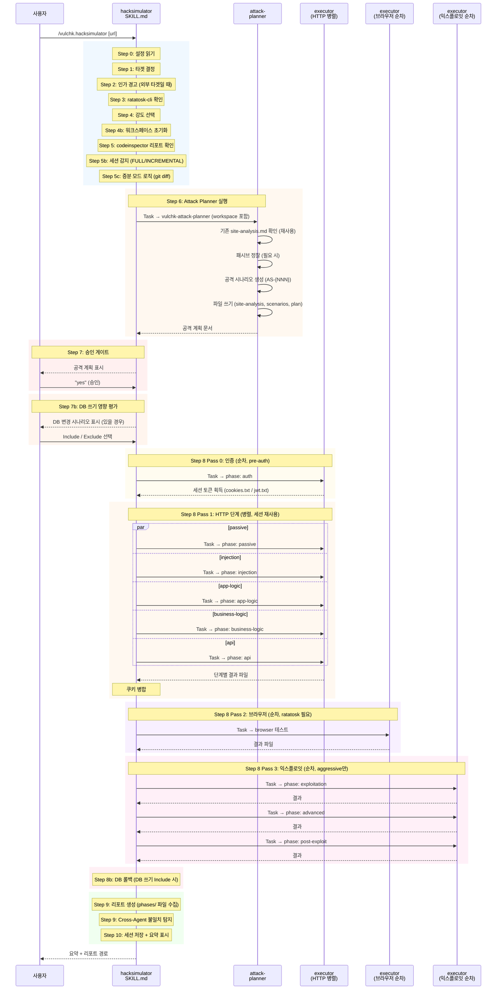

## 단계별 알고리즘

### Step 0: 설정 읽기

```
.vulchk/config.json 읽기 → language (en|ko), version
파일 없으면 → "en"으로 기본 설정, 경고 표시
```

### Step 1: 타겟 결정


### Step 2: 인가 확인

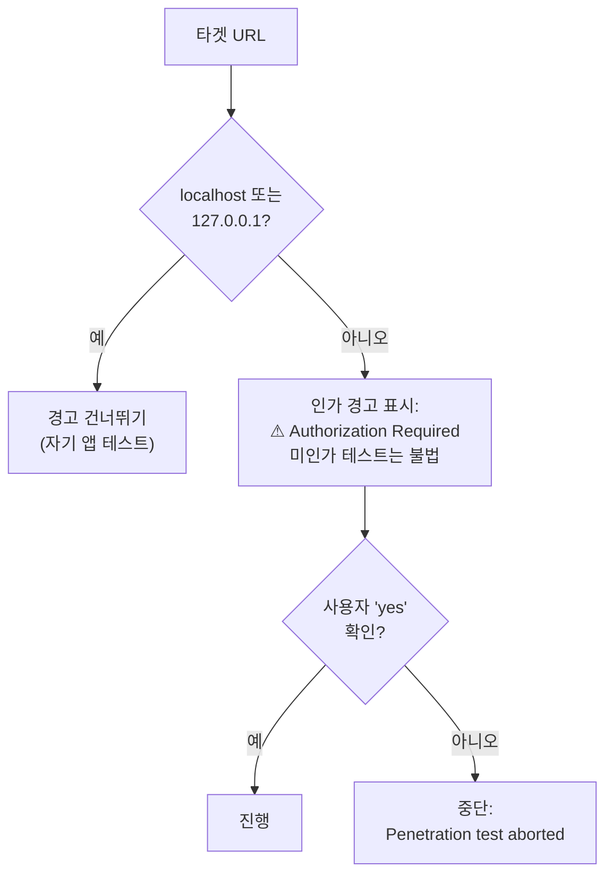

### Step 3: ratatosk-cli 감지

```bash
npm list -g @letsur-dev/ratatosk-cli 2>/dev/null && echo "FOUND" || \
npm list @letsur-dev/ratatosk-cli 2>/dev/null && echo "FOUND" || echo "NOT_FOUND"
```

발견되면 추가 확인:
```bash
ls .claude/skills/ratatosk/ 2>/dev/null && echo "SKILLS_OK" || echo "NO_SKILLS"
```

`RATATOSK_AVAILABLE` 플래그를 설정한다. 미설치 시 HTTP 전용 테스트로
진행하며, 설치 안내 메시지를 표시한다.

### Step 4: 강도 선택

사용자가 3단계 중 하나를 선택한다:

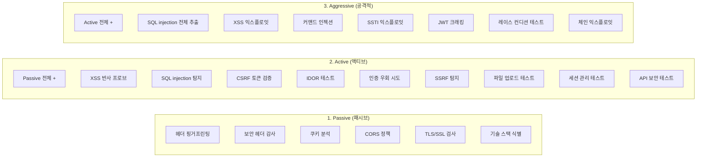

### Step 4b: 워크스페이스 초기화

```bash
mkdir -p .vulchk/hacksim/phases
[ -f .vulchk/hacksim/db-writes.json ] && rm .vulchk/hacksim/db-writes.json
[ ! -f .vulchk/hacksim/methodology.json ] && echo '{"phases":[]}' > .vulchk/hacksim/methodology.json
```

### Step 5: 기존 Code Inspector 리포트 확인

codeinspector 리포트가 존재하면, 발견 사항을 읽어서 attack planner에게
전달하여 공격 벡터의 우선순위를 결정한다. 이것이 **피드백 루프**를 형성한다:

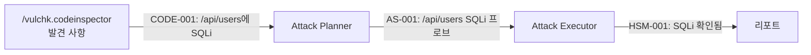

### Step 5b–5c: 세션 감지 및 증분 모드

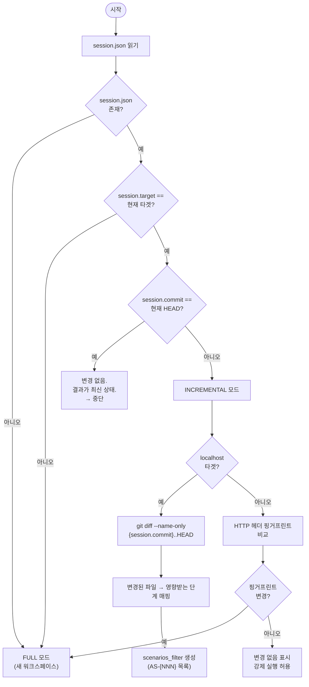

#### 변경 파일 → 영향 단계 매핑

| 변경된 파일 패턴 | 영향받는 단계 |
|----------------|------------|
| 라우트/컨트롤러 파일 | injection, auth, app-logic |
| 인증 미들웨어/설정 | auth |
| 모델/스키마 파일 | injection, business-logic |
| 설정/환경 파일 | passive |
| 프론트엔드/뷰 파일 | XSS, browser |

---

## 서브에이전트: Attack Planner

**파일**: `vulchk-attack-planner.md`
**호출 시점**: hacksimulator SKILL.md Step 6
**모델**: sonnet
**주요 도구**: Bash (curl로 정찰), Write (파일 영속화)
**출력**: 3개 파일 + 공격 계획 텍스트 반환

### 출력 파일

| 파일 | 내용 |
|------|------|
| `site-analysis.md` | 기술 스택, CSS 셀렉터, API 구조, DB 공격 벡터 (SQL/NoSQL/BaaS), 인증 메커니즘, CORS/보안 헤더 |
| `attack-scenarios.md` | 구조화된 공격 시나리오 (AS-{NNN}): 벡터, 단계, 타겟, 파라미터, 기술, 우선순위, **DB Write** |
| `attack-plan.md` | 강도별 공격 계획 (기존 형식) |

### Step 1b 핑거프린팅 확장 (v2.1)

기술 핑거프린팅에 다음 탐지가 추가되었다:
- Supabase: `/rest/v1/`, `/auth/v1/settings` 응답 확인
- Elasticsearch: `/_cat/health` 노출 확인
- Firebase: 페이지 소스에서 `firebaseConfig`/`initializeApp` 탐지

### DB 공격 벡터 섹션 (site-analysis.md)

```
## Database Attack Vectors
- DB Type: {SQL: PostgreSQL | MySQL | MSSQL | SQLite | Oracle} /
           {NoSQL: MongoDB | Redis | Elasticsearch | Firebase | DynamoDB} /
           {BaaS: Supabase | Firebase}
- Query Patterns: {parameterized | raw string | ORM | ODM | PostgREST filter}
- NoSQL Operator Injection: {endpoints accepting JSON body — $ne/$regex/$where risk}
- Supabase (if detected): anon key, service_role key 노출 여부, RLS 상태
```

### 알고리즘

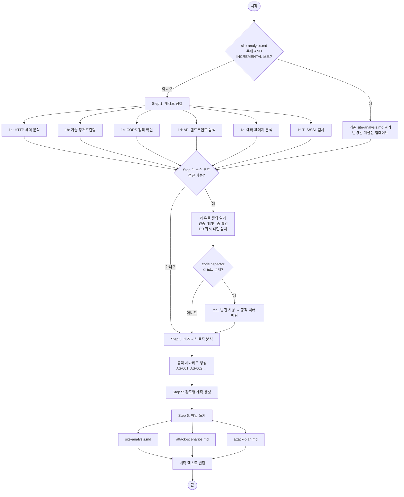

### codeinspector 발견 사항 → 공격 벡터 매핑

| 코드 발견 사항 | 공격 벡터 |
|---|---|
| SQL injection 패턴 (CODE-*) | 해당 엔드포인트에 SQLi 프로브 |
| XSS 취약점 (CODE-*) | 해당 입력에 XSS 페이로드 테스트 |
| 인증 미들웨어 누락 (CODE-*) | 미인증 접근 시도 |
| CORS 설정 오류 (CODE-*) | 자격 증명 포함 크로스 오리진 요청 |
| SSRF 패턴 (CODE-*) | 콜백 URL로 SSRF 프로브 |
| 하드코딩된 시크릿 (SEC-*) | 발견된 자격 증명으로 접근 |
| CSRF 토큰 누락 (CODE-*) | CSRF 위조 시도 |
| MongoDB operator injection 패턴 (CODE-*) | login/search 엔드포인트에 NoSQL `$ne`/`$regex` 프로브 |
| Supabase 키 소스 노출 (SEC-*) | anon key로 `/rest/v1/` 테이블 RLS bypass 확인 |

### 비즈니스 로직 취약점 공격 시나리오

CVE나 OWASP 패턴으로 탐지 불가능한 설계 오류를 테스트한다:

| 앱 유형 | 테스트 시나리오 | 공격 방법 |
|---------|--------------|----------|
| 이커머스 | 가격 변조 | 결제 요청의 price 파라미터를 -1로 변경 |
| 이커머스 | 쿠폰 재사용 | 동일 쿠폰 코드 100회 적용 시도 |
| SaaS | 플랜 제한 우회 | 무료 사용자 토큰으로 유료 API 접근 |
| 게시판 | IDOR | 내 계정으로 다른 사용자의 글 수정/삭제 |
| 공통 | 권한 상승 | 프로필 업데이트 시 `role: "admin"` 주입 |
| 공통 | 워크플로 우회 | 이메일 인증 단계 건너뛰기 |
| 핀테크 | 레이스 컨디션 | 동시 요청으로 잔액 초과 이체 |

---

## 서브에이전트: Attack Executor (6분할 구조)

기존 단일 `vulchk-attack-executor.md` (25.7KB)를 6개 전문 에이전트로 분할.
각 실행에서 해당 phase의 에이전트만 로드되어 평균 로드 ~5KB로 감소.

| 에이전트 | 파일 | 담당 Phase | 크기 |
|---------|------|-----------|------|
| attack-executor-recon | `vulchk-attack-executor-recon.md` | passive | ~5.7KB |
| attack-executor-injection | `vulchk-attack-executor-injection.md` | injection | ~6.3KB |
| attack-executor-auth | `vulchk-attack-executor-auth.md` | auth, app-logic | ~6.6KB |
| attack-executor-business | `vulchk-attack-executor-business.md` | business-logic, api | ~4.8KB |
| attack-executor-baas | `vulchk-attack-executor-baas.md` | BaaS 플랫폼 (조건부) | ~7.1KB |
| attack-executor-exploit | `vulchk-attack-executor-exploit.md` | exploitation, advanced, post-exploit | ~5.1KB |

**공통**: 모든 에이전트가 HSM-{NNN} 접두사, 동일 결과 형식, 동일 에러 핸들링 사용.
**발견 사항 접두사**: `HSM-{NNN}`
**발견 사항 필드** (v2.5): Severity, **Practical Risk**, **Intended Access**, Vector, Endpoint, Scenario, Request, Response, Evidence, References, Remediation
**추가 섹션** (v2.5): 각 phase 결과 파일에 **Passed Tests** 테이블 + **Skipped Tests** 테이블 포함
**모델**: sonnet
**주요 도구**: Bash (curl), Write (결과 파일)

### 입력 파라미터

| 파라미터 | 설명 |
|---------|------|
| `phase` | 실행할 단계 |
| `workspace` | `.vulchk/hacksim/` 경로 |
| `scenarios_filter` | (선택) 실행할 AS-{NNN} ID 목록 (증분 모드) |

**컨텍스트 최소화**: 각 전문 에이전트는 자신의 담당 phase 테스트만 포함하여, 실행 시 불필요한 컨텍스트 로드를 제거한다.

### 알고리즘

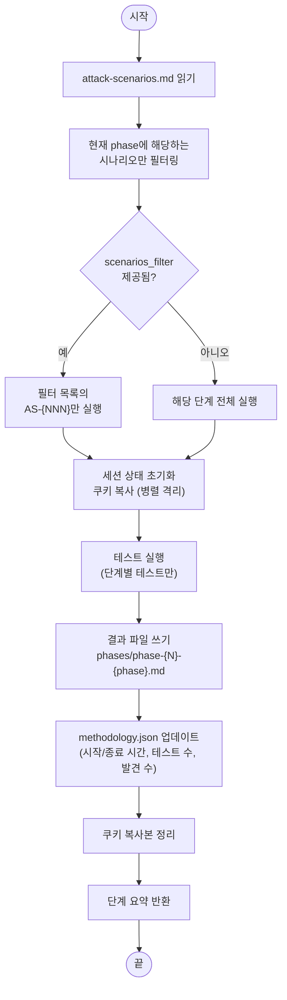

### 단계 매핑

| 단계 번호 | 단계 이름 | 에이전트 | 테스트 내용 | Pass |
|----------|---------|---------|-----------|------|
| 0 | auth | executor-auth | 인증 테스트, JWT 분석, 세션 관리, 세션 토큰 획득 | **Pass 0 (pre-auth, 순차)** |
| 1 | passive | executor-recon | 보안 헤더, 쿠키, CORS, 정보 노출, TLS, 에러 페이지 | Pass 1 (HTTP 병렬) |
| 2 | injection | executor-injection (+executor-baas 조건부) | XSS, SQLi(다중 DB), SSTI, 커맨드 인젝션, NoSQL 인젝션 | Pass 1 (HTTP 병렬) |
| 3 | app-logic | executor-auth | CSRF 검증, HTTP 메서드, 파일 업로드, SSRF | Pass 1 (HTTP 병렬) |
| 4 | business-logic | executor-business | 가격 변조, 워크플로 우회, 권한 상승 | Pass 1 (HTTP 병렬) |
| 5 | api | executor-business | GraphQL, REST API 열거, API 버전 우회 | Pass 1 (HTTP 병렬) |
| 7 | exploitation | executor-exploit | SQLi 추출, XSS 익스플로잇, SSRF 심층, 커맨드 인젝션 | Pass 3 (순차, aggressive) |
| 8 | advanced | executor-exploit | JWT 크래킹, 레이스 컨디션, 파라미터 오염, HTTP 스머글링 | Pass 3 (순차, aggressive) |
| 9 | post-exploit | executor-exploit | 데이터 접근 범위 확인, 익스플로잇 체인 문서화, 영향 평가 | Pass 3 (순차, aggressive) |

### Methodology 추적

각 단계 완료 시 `methodology.json`에 기록:

```json
{
  "phases": [
    {
      "name": "passive",
      "phase_number": 1,
      "started_at": "2025-01-01T10:00:00Z",
      "completed_at": "2025-01-01T10:02:30Z",
      "tests_executed": 15,
      "findings_count": 3,
      "vector": "http-fetch",
      "status": "completed",
      "scenarios_tested": ["AS-001", "AS-002", "AS-003"]
    }
  ]
}
```

### Stateful 테스트

attack-executor는 **모든 HTTP 응답**에서 다음 토큰을 명시적으로 추출하고, 후속 요청에 자동으로 재사용한다:

| 추출 대상 | 추출 위치 | 재사용 방식 |
|----------|---------|-----------|
| **Set-Cookie** | 응답 헤더 `Set-Cookie` | 후속 요청의 `Cookie` 헤더에 포함 |
| **Authorization 토큰** | 응답 본문의 `token`, `access_token`, `jwt` 필드 | 후속 요청의 `Authorization: Bearer {token}` 헤더에 포함 |
| **CSRF 토큰** | 응답 본문의 `csrf`, `_csrf`, `xsrf-token` 필드 또는 `X-CSRF-Token` 헤더 | 후속 요청의 `X-CSRF-Token` 헤더 또는 본문 파라미터에 포함 |

**병렬 실행 시 세션 격리**: 각 HTTP 단계는 시작 시 쿠키 파일을 복사하여
독립적으로 사용한다. 모든 HTTP 단계 완료 후 쿠키를 병합(union)하여
후속 브라우저/익스플로잇 단계에서 사용한다.

### 공격 로그 형식

타겟에 보낸 **모든 요청**이 기록된다:

```
| # | 타임스탬프 | 벡터 | 엔드포인트 | 페이로드 | 상태 | 결과 |
|---|-----------|------|----------|---------|------|------|
| 1 | 2025-01-01 10:00:01 | http-fetch | GET / | (없음) | 200 | 헤더 수집됨 |
| 2 | 2025-01-01 10:00:02 | http-fetch | GET /robots.txt | (없음) | 200 | 경로 발견됨 |
```

벡터 종류:
- `http-fetch` — curl/fetch HTTP 요청
- `browser` — ratatosk-cli 브라우저 자동화
- `api-probe` — API 전용 테스트 (GraphQL, REST)

### 테스트 페이로드 규칙

모든 테스트 페이로드는 `vulchk-` 접두사를 사용하여 식별:
- XSS: `vulchk-xss-probe-12345`
- 파일 업로드: `/tmp/vulchk-test.txt`
- 에러 페이지: `/vulchk-nonexistent-test-path`

### 안전 메커니즘

| 메커니즘 | 설명 |
|---------|------|
| Stateful 세션 관리 | 워크스페이스 내 쿠키/JWT 파일 관리, 병렬 격리 |
| **Orchestrator 429 Handling** | sub-agent의 429 응답 감지 시 전체 태스크 일시 정지(30s) 후 빈도 조절 지시와 함께 재개 |
| **Aggressive Warning** | 파괴적 공격 시나리오(Race Condition 등)에 대해 승인 단계에서 명시적 시각적 경고 제공 |
| CSP 품질 분석 | 단순 존재 여부가 아닌 `unsafe-inline`, `unsafe-eval`, 와일드카드 검사 |
| WAF 감지 | 프로브에 403 응답 시 WAF 제품 식별 |
| 비파괴적 페이로드 | 접근 가능성만 증명, 실제 사용자 데이터 추출 안 함 |
| 마스킹 | 발견된 모든 자격 증명은 마스킹 처리 |
| DoS 금지 | 스레드 고갈이나 리소스 플러딩 금지 |
| 에러 핸들링 | 429→30초 일시정지, 5xx→재시도 1회 후 스킵, 403→WAF 감지·공격적 페이로드 스킵, 타임아웃→로그 후 다음 진행 |
| site-analysis.md 재사용 | passive phase에서 planner가 수집한 정찰 데이터를 읽고 중복 수집 방지 |
| Aggressive 경고 강화 | 실 데이터 삭제/서비스 중단 가능성 경고, 스테이징 환경 권장 |
| 워크스페이스 영속 | 테스트 후 워크스페이스 유지 (증분 모드용) |
| **DB 쓰기 사전 승인** (v2.5) | DB 변경 시나리오에 대해 별도 사전 승인 플로우 (Step 7b) |
| **DB 롤백 사이클** (v2.5) | DB 쓰기 테스트 후 자동 원복 시도, 결과를 `db-rollback.json`에 기록 |
| **Severity Adjustment Rules** (v2.5) | 공개 API, 비활성 기능, 영향 없는 수용에 대한 자동 심각도 보정 |
| **Cross-Agent 불일치 탐지** (v2.5) | 동일 엔드포인트에 대한 에이전트 간 상충 결과 자동 감지 |

### 전문 에이전트별 탐지 기능

| 에이전트 | 탐지 기능 |
|---------|----------|
| **executor-injection** | Multi-DB SQLi (baseline-delta: MySQL SLEEP, MSSQL WAITFOR, PostgreSQL pg_sleep, SQLite RANDOMBLOB), NoSQL `$ne`/`%24regex` 인젝션, SSTI (엔진별 프로브, `49` 결과 탐지), Command Injection |
| **executor-baas** (조건부) | Supabase: anon key 컨텍스트 추출, service_role JWT role claim 검증, RLS 체크 (`[]` vs `[{...}]`), 스토리지 버킷. Firebase: `.vulchkprobe.json` probe. Elasticsearch: primary + `:9200` + 경로 변형 |
| **executor-auth** | 4-Phase 세션 체이닝, JWT none algorithm, IDOR, CSRF, SSRF, Rate Limiting (20회, 100ms 간격) |
| **executor-recon** | CSP 품질 분석 (unsafe-inline/eval/wildcard), 보안 헤더 감사, 쿠키 속성, CORS, TLS, 에러 페이지, **Rate Limiting Assessment** (15건+ 요청 후 429 부재 감지, CWE-799) |

**Supabase 심각도 기준 (executor-baas)**:
- `service_role` JWT with verified role claim 소스 노출 → **Critical**
- anon key로 `/rest/v1/{table}` HTTP 200 + row data → **High** (RLS 미설정)
- 스토리지 공개 버킷 → **Medium~High**
- anon key 소스 노출 (변수 컨텍스트 불명확) → **Low~Medium**

---

## Step 7: 승인 게이트

핵심 안전장치이다. 어떤 테스트가 수행될지에 대한 전체 세부사항을
포함한 공격 계획이 사용자에게 표시된다.
사용자가 명시적으로 승인할 때까지 **타겟에 어떠한 요청도 전송되지 않는다**.

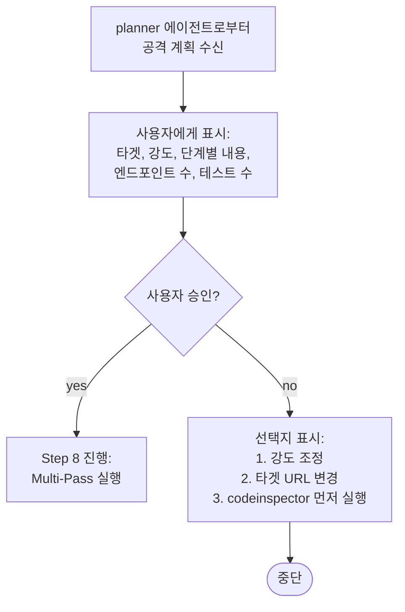

## Step 7b: DB 쓰기 영향 평가

공격 계획 승인 후, executor 실행 전에 DB 쓰기 시나리오를 분석한다.

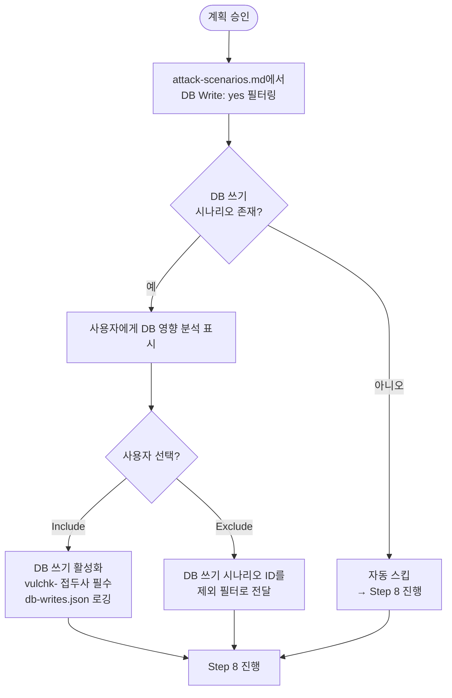

**DB Write 태깅 규칙** (Planner):
- POST/PUT/PATCH/DELETE → 기본 `DB Write: yes`
- GET/HEAD/OPTIONS → `DB Write: no`
- POST이지만 조회 용도 → planner가 명시적으로 `no` 지정

## Step 8: Multi-Pass 실행 모델

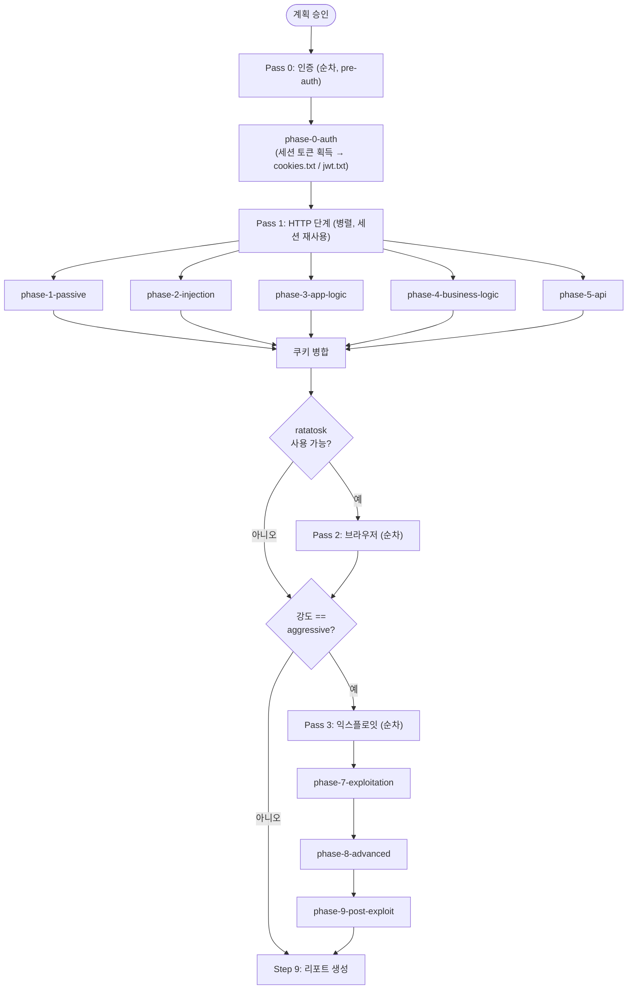

증분 모드에서는 `scenarios_filter`에 해당하는 시나리오가 있는 단계만 실행한다.

## Step 8b: DB 롤백

조건: Step 7b에서 "Include DB writes" 선택 AND `db-writes.json` 존재.

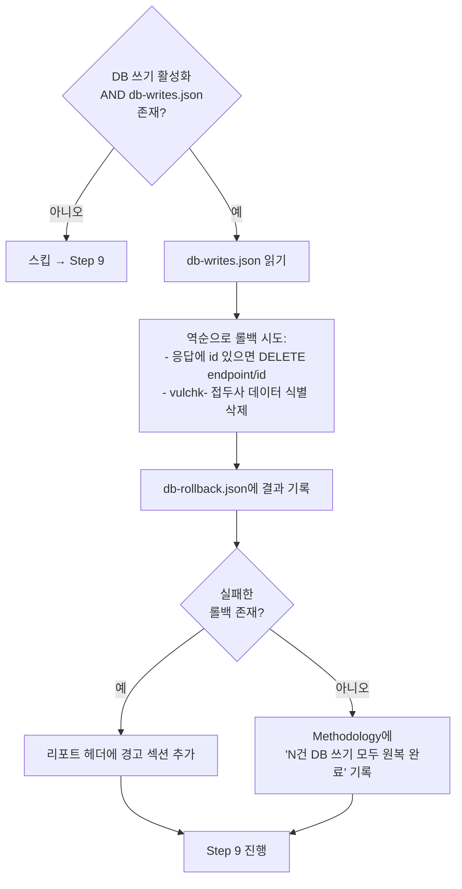

**DB 쓰기 로그 형식** (executor → `db-writes.json`):
```json
[{
  "scenario": "AS-NNN",
  "method": "POST",
  "endpoint": "/path",
  "payload": {...},
  "response_id": "{id}",
  "response_status": 200,
  "timestamp": "...",
  "rollback_hint": "DELETE /path/{id}"
}]
```

## Step 9: 리포트 생성

codeinspector와 동일한 메커니즘 — SKILL.md에서 `"Write the report in {language}"` 형식으로
언어를 지정하며, 별도의 번역 테이블은 사용하지 않는다. 지원 언어: en, ko.

### 리포트 데이터 수집

| 데이터 소스 | 리포트 섹션 |
|-----------|-----------|
| `phases/phase-*.md` 파일들 | Findings, Attack Log |
| `methodology.json` | Methodology (Execution Summary, Scenario Coverage) |
| `attack-scenarios.md` | Methodology (Attack Scenario Coverage) |

hacksimulator 전용 추가 섹션:

| 섹션 | 설명 |
|------|------|
| **Base Commit** (v2.5) | 리포트 헤더에 `git rev-parse --short HEAD` + commit subject 포함 (git repo가 아니면 생략) |
| **Test Result Summary** (v2.5) | Vulnerable(조치 필요), Safe(이상 없음), Not Tested(건너뜀) 3분류 테이블 |
| 공격 계획 요약 | 강도, codeinspector 기반 / 런타임 정찰 기반 여부 |
| Findings Summary | Status 컬럼 추가 (Vulnerable / Pass / Skipped) |
| 공격 로그 | 모든 테스트 시도의 시간순 전체 로그 (단계별 파일에서 병합) |
| **Methodology** | 실행 요약 (단계별 시간/테스트/발견 수), 시나리오 커버리지, 사용 도구 |
| 테스트 범위 | 수행된 테스트, 건너뛴 테스트, 제약 사항 |
| **Positive Findings** (v2.5) | Recommendations 내 하위 섹션 — 앱이 올바르게 수행하는 항목 (입력 검증, CORS 제한 등) |
| **Cross-Agent Note** (v2.5) | Detailed Findings 내 — 서로 다른 에이전트의 동일 엔드포인트 상충 결과 설명 |
| 강도 라벨 | 언어별 번역 (Passive/Active/Aggressive) |

### 강도 라벨 (언어별)

| en | ko |
|---|---|
| Passive | Passive (패시브) |
| Active | Active (액티브) |
| Aggressive | Aggressive (공격적) |

## Step 10: 세션 저장 및 정리

요약 표시 후:

1. `session.json` 업데이트:
   ```json
   {
     "target": "{url}",
     "commit": "{HEAD}",
     "timestamp": "2025-01-01T10:30:00Z",
     "intensity": "{level}",
     "last_report": "./security-report/hacksimulator-{timestamp}.md"
   }
   ```
   → 다음 실행 시 증분 모드 감지에 사용

2. 워크스페이스 파일은 **삭제하지 않음** (증분 모드용)

3. 로컬 실행을 사용한 경우 (Step 1, 옵션 1), 백그라운드 서버 종료:
   ```bash
   kill %1 2>/dev/null
   ```

## Codeinspector vs Hacksimulator 비교

| 항목 | Codeinspector | Hacksimulator |
|------|-------------|--------------|
| 분석 유형 | 정적 (코드) | 동적 (런타임) |
| 대상 | 프로젝트 소스 파일 | 실행 중인 웹 애플리케이션 |
| 승인 필요 | 아니오 (비파괴적) | 예 (요청 전송) |
| 서브에이전트 | 5개 **병렬** | planner 1개 + executor **N개** (Multi-Pass: auth pre-pass → HTTP 병렬 → 브라우저 → 익스플로잇) |
| 사용 모델 | sonnet 3개 + haiku 2개 | sonnet (planner 1 + executor N) |
| 외부 네트워크 | OSV API만 | 타겟 URL + 정찰 |
| 출력 접두사 | DEP/CODE/SEC/GIT/CTR | HSM |
| 사전 데이터 | 없음 | codeinspector 리포트 활용 가능 |
| 벡터 | Grep, Read, Bash | curl, ratatosk (브라우저) |
| 증분 모드 | git diff 기반 (변경 파일만) | git diff 기반 (영향 시나리오만) |
| 워크스페이스 | `.vulchk/codeinspector/` | `.vulchk/hacksim/` |
